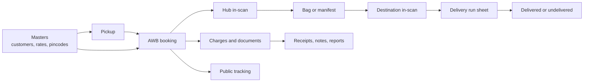
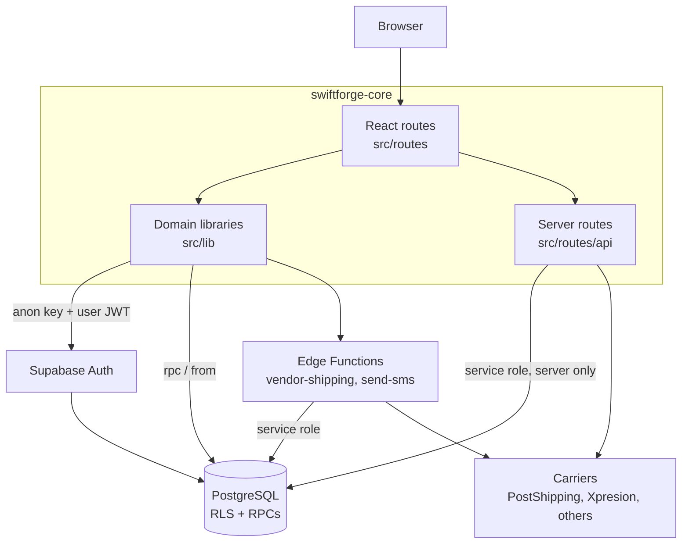
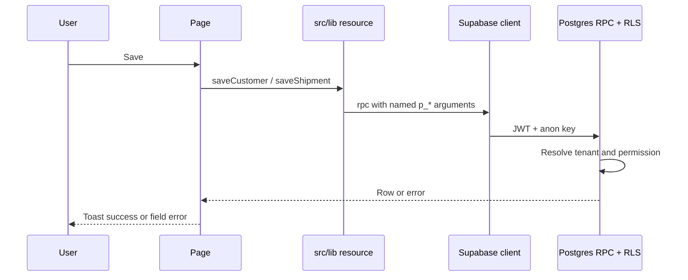
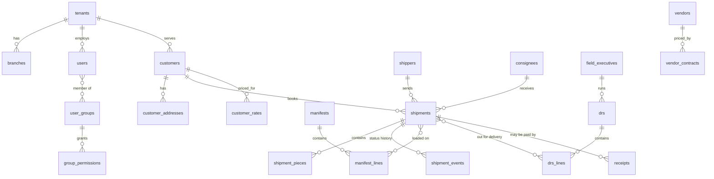

# Project onboarding — Courier Management System

**Audience:** new developers and new operations or finance employees who need to understand the product.  
**App folder:** `swiftforge-core/` (this repository).  
**Reviewed against the code:** 2026-09-24.

This guide explains what the system does, how it is built, and where to look in the code. It is based on the current repository. Where the code is incomplete or older documents disagree with the code, that is marked **Needs confirmation**.

Start with the executive summary. Use the later sections when you need detail. End with the [first-week checklist](#first-week-for-a-new-developer).

Related docs (some are older than this guide):

| Document | Use it for | Caution |
| --- | --- | --- |
| [../PROJECT.md](../PROJECT.md) | Product map and UI conventions | Last reviewed 2026-08-09. Still a good orientation, but backend status has moved on. |
| [PROJECT_STATUS.md](./PROJECT_STATUS.md) | Early module checklist | Last updated 2026-07-06. Treat “pending” and “no backend” notes as **stale**. |
| [backend-blueprint/](./backend-blueprint/00-overview-and-modules.md) | Original design intent | Part 0 says no backend existed yet. That is no longer true. Use it for design history, not current status. |
| [BACKEND_IMPLEMENTATION_STATUS.md](../BACKEND_IMPLEMENTATION_STATUS.md) | Mid-project backend hand-off | Stops around migration `0060`. The repo now has migrations through `0116`. |
| [PROGRESS.md](../PROGRESS.md) | Recent feature notes | Useful for latest work (DTDC, bagging, manifest). It is a working log, not a full map. |
| [DEVELOPMENT_GUIDE.md](./DEVELOPMENT_GUIDE.md) | How to add a screen | Follow this when building a new module. |

---

## Executive summary

This is a **courier operations system** (branded in the app as **Courier ERP**). A courier company uses it to keep customer and rate records, book shipments, move them through hubs, hand them to delivery staff, track them, and record money.

It is built for **staff inside a courier company** (booking clerks, hub staff, delivery coordinators, finance, and admins). Customers are records in the system. There is also a small **public tracking page** that does not require a login.

The application is one TypeScript project:

- **Screens** are React pages under [`../src/routes/`](../src/routes/).
- **Business rules** mostly live in PostgreSQL functions on **Supabase**, not in a separate REST server.
- The browser talks to the database with the **Supabase client**. Row Level Security (RLS) keeps one company’s data away from another company’s data.
- A few server routes and two Supabase Edge Functions call outside carriers (DTDC / PostShipping, Xpresion, World First, and others).

The day-to-day story of a parcel is:

1. Create the customer (and shipper / consignee if needed).
2. Optionally schedule a **pickup**.
3. Book the shipment on **AWB Entry** (AWB means Air Waybill — the shipment’s tracking number).
4. Scan it in at the hub, put it on a **manifest** or **bag**, and send it onward.
5. At the destination, put it on a **DRS** (Delivery Run Sheet) and scan the delivery outcome.
6. Record receipts, expenses, debit notes, and credit notes.
7. Look the shipment up in **AWB Query** or on the public track page.

---

## 1. Project overview

### What problem it solves

Courier companies have to coordinate many small, time-sensitive steps: who is sending the parcel, who is receiving it, which rate applies, which hub has it, which vehicle is carrying it, and whether it was delivered or came back.

This system is the internal desk for that work. It is modeled on the operator workflow of **CourierWala / Xpresion** (dense forms, scan screens, report dropdowns). The goal in the codebase is to keep that workflow and store the data in a modern multi-company database. See [../BACKEND_IMPLEMENTATION_STATUS.md](../BACKEND_IMPLEMENTATION_STATUS.md).

It is **not** a consumer shopping app. Most screens assume a trained clerk who uses the keyboard (Enter moves to the next field).

### Who uses it

| Person | How they use the system | Where this shows up |
| --- | --- | --- |
| **Tenant admin** | Sets up the company, users, and access | User type `ADMIN`. System group `TENANT_ADMIN` in [`../supabase/migrations/0012_provisioning.sql`](../supabase/migrations/0012_provisioning.sql). |
| **Operations staff** | Bookings, scans, manifests, delivery runs, tracking | User type `STAFF`. System group `OPERATIONS`. |
| **Accounts / finance** | Receipts, expenses, notes, account reports | System group `ACCOUNTS`. |
| **Customer login** | A customer-type user tied to one customer record | User type `CUSTOMER` on `public.users`. A full customer portal is **Needs confirmation** — the type exists; a separate customer app was not found. |
| **Public visitor** | Tracks one shipment without logging in | [`../src/routes/public.track.tsx`](../src/routes/public.track.tsx) at `/public/track`. |
| **Platform admin** | Cross-company access flag in the database | `app.is_platform_admin()`. No dedicated super-admin screen was found. **Needs confirmation.** |

Field executives (riders / pickup staff) are **master records**, not a separate mobile app in this repo. Permission section `MOBILE` exists in the database for a future or external app. **Needs confirmation** whether that mobile app is built elsewhere.

### Main business purpose

One installation can serve **many courier companies** (tenants). Each tenant has branches (service centres), customers, vendors (carriers such as DTDC or Blue Dart), rates, and shipments. Users only see rows for tenants they belong to.

### Core workflows



Sidebar groups in [`../src/lib/navigation.ts`](../src/lib/navigation.ts):

1. **Dashboard** — live counts for operations, finance, and customers.
2. **Master** — reference data that other screens look up.
3. **Transaction** — daily shipment work.
4. **Reports** — filtered lists and exports.
5. **Utility** — users, imports, tax, fuel, rates, and integrations.

---

## 2. Technology overview

| Layer | Technology | Why it is used here |
| --- | --- | --- |
| Language | TypeScript | Shared types for screens, forms, and database calls. |
| UI | React 19 | Component screens. Function components and hooks only. |
| App framework | TanStack Start | File-based routes plus server handlers in the same project. Entry wrapper: [`../src/server.ts`](../src/server.ts). |
| Routing | TanStack Router | A file such as `transaction.awb-entry.tsx` becomes `/transaction/awb-entry`. Generated tree: [`../src/routeTree.gen.ts`](../src/routeTree.gen.ts) — do not edit by hand. |
| Server data in the UI | TanStack React Query | Loads and refreshes lists after saves. There is no Redux or Zustand. |
| Database and auth | Supabase (PostgreSQL + Auth) | One hosted Postgres database, login, file storage, and Edge Functions. Client: [`../src/integrations/supabase/client.ts`](../src/integrations/supabase/client.ts). |
| API style | Postgres functions (RPCs) through PostgREST | Most features call `supabase.rpc("function_name", …)` or `supabase.from("table")`. RLS applies. There is no Express or Fastify app. |
| Styling | Tailwind CSS v4 | Utility classes. Design tokens live in [`../src/styles.css`](../src/styles.css). |
| UI kit | shadcn/ui on Radix | Buttons, dialogs, tables, sheets in [`../src/components/ui/`](../src/components/ui/). |
| Forms | react-hook-form and Zod on newer modules; local state on many older masters | Zod schemas live under [`../src/lib/masters/schemas/`](../src/lib/masters/schemas/) and [`../src/lib/transactions/schemas/`](../src/lib/transactions/schemas/). |
| Dates, charts, files | date-fns, recharts, jsPDF, ExcelJS, xlsx | Invoices, labels, Excel import/export, dashboard charts. |
| Tests | Vitest | `npm test`. SQL checks live in [`../supabase/tests/`](../supabase/tests/). |
| Lint / format | ESLint 9 and Prettier | `npm run lint`, `npm run format`. |
| Build | Vite 8, Nitro | [`../vite.config.ts`](../vite.config.ts) uses `@lovable.dev/vite-tanstack-config`. The comment there says the production target defaults to **Cloudflare**. |
| Package name | `tanstack_start_ts` | See [`../package.json`](../package.json). |

**Needs confirmation:** the live production URL and whether Cloudflare is the host you actually deploy to. The repo configures that target; this guide cannot see the hosting account.

### Why these choices fit the product

- **Supabase + RLS** lets every screen share one database while still isolating companies. Permission checks run in SQL, so hiding a button in React is not the real security boundary.
- **TanStack Start** keeps pages and a few server routes (pincode search, rating, carrier booking) in one codebase.
- **shadcn + Tailwind** keeps the dense ERP screens consistent without a second design system.
- **RPCs** hold workflows that must stay consistent (booking a shipment, scanning a bag, checking a status change). The UI should not invent those rules.

---

## 3. Architecture

### How the pieces connect



Plain-language version:

1. The user opens a page. The shell is [`../src/routes/__root.tsx`](../src/routes/__root.tsx): sidebar, header, theme, auth, and branch context.
2. The page calls a function in `src/lib/...`.
3. That function uses the **browser Supabase client** (publishable / anon key). The user’s login token is attached, so the database knows who they are.
4. PostgreSQL checks RLS and permission functions, then returns rows or runs an RPC such as `save_shipment`.
5. When a secret must stay off the browser (carrier passwords, service-role key), the call goes through a **server route** or an **Edge Function**.

### Two different “tenant” ideas

| Mechanism | What it really does | File |
| --- | --- | --- |
| Hostname branding | Picks a display name from a small hardcoded list (`courierwalaexpress`, `companya`, `companyb`). Used for the login company hint and dashboard greeting. | [`../src/lib/tenant.tsx`](../src/lib/tenant.tsx) |
| Database tenant | The real company. `tenant_users` links the login to a tenant. Almost every business table has `tenant_id`. | Migrations `0002` onward |

Do not treat the hostname mock as security. Isolation is the database. The login screen still asks for a **company code**, and the username is turned into a fake email: `username@company-code.cms.local`. See [`../src/lib/auth.tsx`](../src/lib/auth.tsx).

### Request path for a normal save



Errors from Postgres are turned into messages by `translateDbError` in [`../src/lib/masters/core/baseCrud.ts`](../src/lib/masters/core/baseCrud.ts) and `toErrorMessage` in [`../src/lib/masters/screen/helpers.ts`](../src/lib/masters/screen/helpers.ts). The UI uses **sonner** toasts, not `alert()`.

Server-rendered crashes are caught in [`../src/server.ts`](../src/server.ts) and [`../src/start.ts`](../src/start.ts) and replaced with a simple HTML error page.

### Important architecture decisions

1. **Database is the API.** New business rules usually mean a SQL migration plus a small TypeScript wrapper, not a new microservice.
2. **UI permission checks are advisory.** `hasPermission` hides buttons. The database still refuses the write.
3. **Soft delete and row versions.** Master rows use `deleted_at`. Updates send the expected `row_version` so two people cannot overwrite each other silently.
4. **Status changes are an allow-list.** Table `app.status_transitions` says which shipment status can follow which. Functions call `app.assert_status_transition`.
5. **Many screens still have a demo mode.** If you are not signed in, some pages keep rows in memory (`demoRows`) and skip the database. Signed-in mode is the real product.

---

## 4. Modules and features

Navigation is the menu. A route file is the screen. A splat file (`master.$.tsx`, `transaction.$.tsx`, and similar) shows a “not built yet” page when the menu points at a URL with no dedicated file.

**Product Master** (`/master/sales/product-master`) is the menu item that still falls through to the placeholder in [`../src/routes/master.$.tsx`](../src/routes/master.$.tsx). **Product** (`/master/sales/product`) is a real screen.

### 4.1 Shell

| Purpose | Screens | Main files | Who | Connects to |
| --- | --- | --- | --- | --- |
| Sign in, home, navigation | `/login`, `/`, `/dashboard` | [`../src/routes/login.tsx`](../src/routes/login.tsx), [`../src/routes/dashboard.tsx`](../src/routes/dashboard.tsx), [`../src/components/app-sidebar.tsx`](../src/components/app-sidebar.tsx), [`../src/components/app-header.tsx`](../src/components/app-header.tsx) | All staff | Every module. Dashboard KPIs come from rollup RPCs (`get_dashboard_summary`). |

`/` redirects to `/dashboard`. Login and `/public/*` render **without** the sidebar.

### 4.2 Master — Sales

Reference data for products, geography, branches, and charges.

| Screen | Path | Route file |
| --- | --- | --- |
| Product | `/master/sales/product` | [`../src/routes/master.sales.product.tsx`](../src/routes/master.sales.product.tsx) |
| Zone, Country, Destination, State | `/master/sales/...` | `master.sales.zone.tsx`, `country.tsx`, `destination.tsx`, `state.tsx` |
| Service Center, Local Branch | same pattern | `service-center.tsx`, `local-branch.tsx` |
| Sales Executive, Industry, Flight, Product Type, Content, Instruction | same pattern | matching `master.sales.*.tsx` files |
| Charges Master, Bank Master | same pattern | `charges-master.tsx`, `bank-master.tsx` |
| Product Master | `/master/sales/product-master` | Placeholder only |

**Data:** `products`, `product_types`, `zones`, `countries`, `states`, `destinations`, `service_centers`, `local_branches`, `sales_executives`, `industries`, `flights`, `contents`, `instructions`, `charges`, `banks`.  
**Who:** admins and operations (operations group is mostly read-only on masters).  
**Connects to:** AWB Entry, rating, manifests, and reports. Lookups use [`../src/components/master-lookup-dialog.tsx`](../src/components/master-lookup-dialog.tsx).

### 4.3 Master — Customer (CRM)

| Screen | Path | Purpose | Data |
| --- | --- | --- | --- |
| Customer | `/master/customer/customer` | Company account: KYC, billing, addresses, fuel, charges | `customers` and child tables. Save RPC: `save_customer`. |
| Customer Rate | `/master/customer/customer-rate` | Lane rates (origin, destination, weight, price) | `customer_rates` |
| Consignee | `/master/customer/consignee` | Receiver address book | `consignees`, `consignee_kyc_documents` |
| Shipper | `/master/customer/shipper` | Sender address book | `shippers`, `shipper_kyc_documents` |
| Expense | `/master/customer/expense` | Expense / income heads | `expense_heads` |

**Files:** [`../src/routes/master.customer.customer.tsx`](../src/routes/master.customer.customer.tsx), [`../src/lib/masters/resources/customers.ts`](../src/lib/masters/resources/customers.ts).  
**Who:** sales and operations setup; finance uses the billing flags.  
**Connects to:** pickup, AWB booking, rating, receipts.

### 4.4 Master — Vendor

Carriers and agents the company hands parcels to.

| Screen | Path | Data |
| --- | --- | --- |
| Vendor | `/master/vendor/vendor` | `vendors`, addresses, contacts, bank accounts, services |
| Vendor Contract | `/master/vendor/vendor-contract` | `vendor_contracts`, `vendor_contract_slabs` |

**Also related:** Service Mapping (`/master/operation/service-mapping`) links a vendor service to billing and, in later migrations, to carrier API tokens.

### 4.5 Master — Operation

| Screen | Path | Purpose |
| --- | --- | --- |
| Service Mapping | `/master/operation/service-mapping` | Which vendor service to use |
| Field Executive | `/master/operation/field-executive` | Pickup and delivery staff |
| Pin Code | `/master/operation/pin-code` | Serviceable Indian pincodes, ODA, zone |
| Area | `/master/operation/area` | Delivery areas inside a service centre |
| Exception | `/master/operation/exception` | Status words used on tracking (“undelivered”, and so on) |
| Airline | `/master/operation/airline` | Airlines for air cargo |
| Country Pincodes | `/master/operation/country-pincodes` | International postal codes |

**Data:** `service_mappings`, `field_executives`, `pincodes`, `areas`, `delivery_exceptions`, `airlines`, `country_pincodes`, plus `postal_pincodes` for typeahead.

### 4.6 Transactions — booking and first mile

| Screen | Path | Purpose | Main files | Data |
| --- | --- | --- | --- | --- |
| Pickup | `/transaction/pickup` | Schedule a pickup, assign a field executive, cancel | [`../src/routes/transaction.pickup.tsx`](../src/routes/transaction.pickup.tsx), [`../src/lib/transactions/resources/pickups.ts`](../src/lib/transactions/resources/pickups.ts) | `pickups` |
| Pickup Inscan | `/transaction/pickup-inscan` | Scan a picked shipment into the hub | [`../src/routes/transaction.pickup-inscan.tsx`](../src/routes/transaction.pickup-inscan.tsx) | `pickup_inscan_events` |
| AWB Entry | `/transaction/awb-entry` | Book or edit the shipment, charges, vendor booking, labels and invoices | [`../src/routes/transaction.awb-entry.tsx`](../src/routes/transaction.awb-entry.tsx), [`../src/lib/transactions/resources/shipments.ts`](../src/lib/transactions/resources/shipments.ts) | `shipments` and children |

AWB Entry is the main screen. It is large on purpose: parties, pieces, charges, proforma (customs), forwarding, KYC, and documents.

### 4.7 Transactions — linehaul (moving between hubs)

| Screen | Path | Purpose | Data |
| --- | --- | --- | --- |
| Manifest Scan | `/transaction/manifest-scan` | Build an outbound manifest and scan AWBs onto it | `manifests`, `manifest_lines` |
| Manifest In Scan | `/transaction/manifest-in-scan` | Receive a manifest; optional re-weigh | `manifest_scan_events` |
| Manifest View | `/transaction/manifest-view` | Search manifests and open lines | same tables |
| Bagging | `/transaction/bagging` | Group international AWBs into bags | `bagging_manifests`, `bagging_awb_lines` |
| Transfer Run | `/transaction/transfer-run` | Move bags between manifests or offload | Reads `manifests` (and bagging). See [`../src/lib/transactions/resources/transferRun.ts`](../src/lib/transactions/resources/transferRun.ts). |
| OBC Entry | `/transaction/out-scan/obc-entry` | On-board courier despatch | Frontend uses table `obc_entries`. **No migration in this repo creates that table.** Needs confirmation. |

### 4.8 Transactions — delivery and tracking

| Screen | Path | Purpose |
| --- | --- | --- |
| DRS Scan | `/transaction/drs-scan` | Delivery run sheet for an area and field executive |
| Un-Delivery Scan | `/transaction/un-delivery-scan` | Same engine as pickup in-scan, mode `undelivery` |
| Miss Route Scan | `/transaction/miss-route-scan` | Mark a shipment misrouted |
| AWB Query | `/transaction/tracking/awb-query` | Full shipment view: status, scans, charges, comments |
| Forwarding Updation | `/transaction/tracking/forwarding-updation` | Attach the carrier’s tracking number |
| Progress / Comment | `/transaction/tracking/progress-comment` | Manual status note |
| KYC Tracking | `/transaction/tracking/kyc-tracking` | KYC documents on parties or AWBs |
| Update Entry | `/transaction/tracking/update-entry` | Hold / release and lock dates |
| POD to Excel | `/transaction/bulk-import/pod-to-excel` | Proof-of-delivery bulk view |
| Public track | `/public/track` | Customer-safe status, no login |

**Data:** `drs`, `drs_lines`, `tracking_events`, `pod_records`, `shipment_events`, `shipment_holds`, `shipment_comments`.

### 4.9 Transactions — money and rates

| Screen | Path | Purpose | Data |
| --- | --- | --- | --- |
| Receipt Entry | `/transaction/receipt/receipt-entry` | Money received | `receipts` |
| Expense Entry | `/transaction/receipt/expense-entry` | Expense voucher, starts unauthorized | `expense_entries` |
| Expense Authorize | `/transaction/receipt/expense-authorize` | Second person approves the expense | same |
| Debit Note / Credit Note | `/transaction/receipt/debit-note`, `credit-note` | Adjustments, including GST fields | `debit_notes`, `credit_notes` |
| Customer Payment | `/transaction/receipt/customer-payment` | Customer-declared payment: pending, approved, or rejected | `customer_payments` |
| Vendor / Customer Rate Compare | `/transaction/rate-compare/...` | Compare what you charge vs what the vendor costs | rates tables |

Invoices and IRN (India e-invoice reference numbers) exist as database features and a client in [`../src/lib/integrations/irn.ts`](../src/lib/integrations/irn.ts). The IRN path is marked **sandbox** in that file. A full invoice screen in the sidebar was not found. **Needs confirmation** which invoice UI staff should use day to day (AWB document drawer vs a separate invoice module).

### 4.10 Reports

| Hub | Path | UI |
| --- | --- | --- |
| Operations | `/reports/operations` | [`../src/components/reports/operations/`](../src/components/reports/operations/) |
| Statements | `/reports/statements` | [`../src/components/reports/statements/`](../src/components/reports/statements/) |
| AWB | `/reports/awb` | [`../src/components/reports/awb/`](../src/components/reports/awb/) |
| Scan | `/reports/scan` | [`../src/components/reports/scan/`](../src/components/reports/scan/) |
| Accounts | `/reports/ar-report` | [`../src/components/reports/accounts/`](../src/components/reports/accounts/) |
| Job list | `/reports/jobs` | [`../src/routes/reports.jobs.tsx`](../src/routes/reports.jobs.tsx) — not in the main sidebar list |
| One report | `/reports/run/$reportKey` | [`../src/routes/reports.run.$reportKey.tsx`](../src/routes/reports.run.$reportKey.tsx) |

Reports are defined in the database (`report_definitions`) and run with `execute_report`. Large exports can be queued as `report_jobs`.

### 4.11 Utility

| Area | Paths | Purpose |
| --- | --- | --- |
| Serviceable Pincode | `/utility/serviceable-pincode` | “Can we deliver to this pin?” |
| Notification | `/utility/notification` | Broadcast messages |
| Integration Configuration | `/utility/integration-configuration` | Carrier credentials (secrets stay server-side) |
| Users | `/utility/users/user-setup`, `access-rights`, `loggedin-users` | People, permission matrix, force logoff |
| Excel Import | `/utility/excel-import/...` | Bulk AWB, POD, forwarding, data import and update |
| Tax / Charges | `/utility/tax-charges-setup/...` | Fuel %, GST %, company setup |
| Rate / Zone Update | `/utility/rate-zone-update/...` | Bulk rate or zone jobs |

---

## 5. Important user journeys

These are the flows the code actually implements. Screen labels match the sidebar.

### 5.1 Sign in and permissions

1. Open `/login`.
2. Enter **company code**, **username**, and **password**.
3. The app builds an email: `username@companycode.cms.local` and calls Supabase `signInWithPassword`.
4. It then calls RPCs `me` and `me_permissions`, and `record_login` (so Logged-in Users can see the session).
5. The app stores a session id in `localStorage` under `cms.session_id`.
6. You land on `/dashboard`.
7. Buttons call `hasPermission(slug, action)`. Actions are add, modify, delete, list, and search. `all_access` allows all five.
8. Sign out calls `record_logout` and Supabase `signOut`.

There is **no global redirect** that forces every URL to `/login`. Unsigned pages can still open and may show **demo rows that are not saved**. Always sign in before testing real data.

**Needs confirmation:** the company code your team uses in each environment (local seed uses slug `devco` in [`../supabase/seed.sql`](../supabase/seed.sql); the hostname mock defaults to `courierwalaexpress`).

### 5.2 Create a customer

1. Go to **Master → Customer → Customer**.
2. Add a row. The form covers identity, billing, addresses, fuel, other charges, volumetric rules, and KYC documents.
3. When signed in, save calls `save_customer` from [`../src/lib/masters/resources/customers.ts`](../src/lib/masters/resources/customers.ts).
4. Child rows live in `customer_addresses`, `customer_fuel_surcharges`, `customer_other_charges`, `customer_volumetrics`, and `customer_kyc_documents`.
5. The new customer can be picked on Pickup and AWB Entry.

When signed out, the same screen edits `demoRows` in the browser only.

### 5.3 Book a shipment (AWB)

1. Go to **Transaction → AWB Entry**.
2. Start a new entry or open an existing AWB.
3. Fill shipper, consignee, product, pieces, and payment type. Pincode fields call `/api/pincodes` (or a local fallback).
4. Save calls `save_shipment` (status can stay `DRAFT`).
5. Confirm booking calls `validate_shipment_booking` and `confirm_booking`. Status becomes `BOOKED` and an AWB number is allocated.
6. Extra gates in later migrations include AWB stock (`branch_awb_allotments`), ID checks (PAN, GSTIN, Aadhaar, IEC), and international KYC before manifest.
7. After save, document links can open a side panel for label, AWB, and invoice. Generators: [`../src/lib/transactions/awbLabelGenerator.ts`](../src/lib/transactions/awbLabelGenerator.ts), [`../src/lib/transactions/invoiceGenerator.ts`](../src/lib/transactions/invoiceGenerator.ts).
8. Optional: vendor panel books the same shipment with a carrier (see section 7).

### 5.4 Assign pickup and delivery

**Pickup**

1. **Transaction → Pickup.** Create a pickup for a customer / shipper, address, area, and field executive.
2. Status path seeded in the database: `OPEN` → `ASSIGNED` → `PICKED` → `CONFIRMED`, or `CANCELLED`.
3. **Pickup Inscan** scans the AWB into the origin hub. Eligible shipments move toward `PICKUP_INSCANNED`.

**Delivery**

1. **DRS Scan.** Choose area and field executive. Scan AWBs onto the run sheet.
2. The intended status step is toward `OUT_FOR_DELIVERY`.
3. Complete the stop as delivered, attempted, or undelivered.
4. **Un-Delivery Scan** records “shipment undelivered received” when the parcel comes back to the hub. It requires `OUT_FOR_DELIVERY` in migration `0109`.

### 5.5 Update shipment status

Staff usually do **not** type a status by hand. A scan or RPC moves it, and `app.assert_status_transition` rejects illegal jumps.

A practical happy path (later migrations added extra steps, so a real shipment may skip or insert a step):

`DRAFT` → `BOOKED` → `PICKUP_INSCANNED` → `BAGGED` or `MANIFESTED` → `MANIFEST_INSCANNED` → `OUT_FOR_DELIVERY` → `DELIVERED` or `UNDELIVERED`.

Other statuses that exist in the check constraint (migration `0037`): `IN_TRANSIT`, `RECEIVED_AT_HUB`, `ON_DRS`, `MISROUTED`, `DELIVERY_ATTEMPTED`, `DELIVERED_PENDING_POD`, `UNDELIVERED_RECEIVED`, `RTO_INITIATED`, `RTO_DELIVERED`, `CANCELLED`, `VOID`.

**Needs confirmation:** which path your operations team treats as official, because early and later migrations do not describe one single line.

Manual notes are **Tracking → Progress / Comment**. Holds are **Update Entry**.

### 5.6 Track a shipment

**Staff:** **Tracking → AWB Query**. Search by AWB. The page loads the shipment plus progress, comments, pieces, proforma, scans, and manifest lines.

**Customer / public:** `/public/track`. Enter AWB or carrier tracking number. The page calls `public_track_shipment`, which is allowed for anonymous users and returns a limited JSON payload (status, origin, destination, timeline). It must not return prices or KYC.

### 5.7 Payment and invoice

There is no single “checkout” flow. Money is recorded as operations documents:

1. Charges are calculated on the AWB (customer charge lines, fuel, GST). A rating helper also exists at `POST /api/shipments/rate` and in SQL migration `0041`.
2. **Receipt Entry** records money received into cash or bank.
3. **Expense Entry** then **Expense Authorize** is a maker-checker pair.
4. **Debit Note** and **Credit Note** adjust an AWB. IRN generation is a separate sandbox integration.
5. **Customer Payment** is the customer’s claim of payment, then approve or reject.
6. **Reports → Accounts** reads ledger-style reports (outstanding, details, ageing).

**Needs confirmation:** whether invoice numbers printed from AWB Entry are the same documents as `public.invoices` used by the IRN functions.

---

## 6. Data model

Almost every business table has:

- `tenant_id` — which company owns the row
- `created_at`, `updated_at`, `created_by`, `updated_by`
- `row_version` — optimistic locking
- `deleted_at` — soft delete, where the table uses it

Passwords are **not** stored in these tables. Supabase Auth stores them.

### Main groups

| Group | Tables | In plain language |
| --- | --- | --- |
| Company | `plans`, `tenants`, `tenant_users`, `tenant_subscriptions`, `branches`, `financial_years`, `sequence_counters`, `tenant_settings` | The courier company, its plan, its branches, and document number counters. |
| People and access | `users`, `user_groups`, `user_group_members`, `user_branch_access`, `permission_modules`, `group_permissions`, `sessions`, `login_logs` | Staff profiles, roles, which branches they may open, and who is logged in. |
| Parties | `customers` + children, `shippers`, `consignees`, `vendors` + children | Who pays, who sends, who receives, which carrier you use. |
| Places and catalog | `countries`, `zones`, `states`, `destinations`, `pincodes`, `areas`, `products`, `charges`, `service_centers`, `field_executives` | Places you serve and the products and fees you sell. |
| Rates | `customer_rates`, `vendor_contracts`, `vendor_contract_slabs`, `zone_mappings`, `fuel_surcharge_rates`, `tax_rates` | What to charge and what the carrier costs, by date. |
| Shipment | `shipments`, `shipment_pieces`, `shipment_charge_snapshots`, `shipment_events`, `shipment_comments`, `shipment_documents`, `shipment_holds` | The AWB and its history. |
| Movement | `pickups`, `manifests`, `manifest_lines`, `bagging_manifests`, `bagging_awb_lines`, `drs`, `drs_lines`, `pod_records`, `tracking_events` | Pickup, linehaul, delivery, proof, and the public timeline. |
| Money | `receipts`, `expense_entries`, `expense_heads`, `customer_payments`, `ledger_entries`, `invoices`, `debit_notes`, `credit_notes`, `irn_logs` | Cash, approvals, and tax documents. |
| Jobs and files | `import_jobs`, `report_jobs`, `rate_update_jobs`, `zone_update_jobs`, `files`, `audit_logs` | Bulk work, exports, uploads, and an append-only audit trail. |
| Integrations | `integration_providers`, `integration_credentials`, `integration_logs`, `vendor_integrations`, `vendor_service_tokens`, `webhooks`, `webhook_deliveries` | Outside systems and outbound events. |

### How the important rows relate



A **shipment** points at a customer, and usually at a shipper and consignee. A **manifest line** or **DRS line** points at that shipment. Deleting a master in the UI is a soft delete (`deleted_at`), not a hard wipe, on tables that follow the master pattern.

The internal schema `app` holds helper functions (`user_tenant_ids`, `user_has_permission`, `assert_status_transition`) and the status-transition table. Application code should call `public` RPCs, not write those helpers from the browser.

---

## 7. API and integrations

### How to call the backend

Preferred pattern (browser, user logged in):

```ts
const { data, error } = await supabase.rpc("execute_report", {
  p_report_key: "some-key",
  p_filters: {},
  p_page: 1,
  p_page_size: 50,
  p_sort_by: null,
  p_sort_dir: "desc",
});
```

Argument names must match the SQL parameter names (`p_*`). The client is [`../src/integrations/supabase/client.ts`](../src/integrations/supabase/client.ts).

Server-only client (bypasses RLS): [`../src/integrations/supabase/client.server.ts`](../src/integrations/supabase/client.server.ts). Import it with a dynamic `import()` inside a server handler only.

Auth middleware for server functions: [`../src/integrations/supabase/auth-middleware.ts`](../src/integrations/supabase/auth-middleware.ts). It requires `Authorization: Bearer <jwt>`.

### Server routes in this app

| Route | Method | Role |
| --- | --- | --- |
| `/api/pincodes` | GET | Postal-code typeahead. Uses service role RPC `search_postal_pincodes`, then a local fallback. [`../src/routes/api/pincodes.ts`](../src/routes/api/pincodes.ts). |
| `/api/shipments/rate` | POST | Rates a shipment in the rating engine. Can use seed rates if the database lookup is empty. [`../src/routes/api/shipments.rate.ts`](../src/routes/api/shipments.rate.ts). |
| `/api/awb-entry/status` | GET | AWB stock / document-number snapshot for the entry screen. Uses the service-role client. [`../src/routes/api/awb-entry.status.ts`](../src/routes/api/awb-entry.status.ts). |
| `/api/shipping/ups/book` | POST | Books UPS through an Xpresion-style HTTP API. Credentials come from server env vars. [`../src/routes/api/shipping.ups.book.ts`](../src/routes/api/shipping.ups.book.ts). |
| `/api/shipping/world-first/book` | POST | Books World First / WFT through a similar HTTP API. [`../src/routes/api/shipping.world-first.book.ts`](../src/routes/api/shipping.world-first.book.ts). |

**Security note:** the World First route falls back to demo credential strings in source if env vars are missing. Do not copy those values into docs, tickets, or chat. **Needs confirmation** that production always sets the env vars and that the fallback should be removed.

Env **names** only (set them in `.env`, never commit values):

| Name | Where it is read | Purpose |
| --- | --- | --- |
| `VITE_SUPABASE_URL` | Browser and server | Project URL, no `/rest/v1` suffix |
| `VITE_SUPABASE_PUBLISHABLE_KEY` or `VITE_SUPABASE_ANON_KEY` | Browser | Public key. RLS still applies. |
| `SUPABASE_SERVICE_ROLE_KEY` | Server only | Bypasses RLS. No `VITE_` prefix. |
| `SUPABASE_DB_URL` | Optional, CLI / psql | Direct Postgres URL |
| `WF_API_URL`, `WF_USER_ID`, `WF_PASSWORD`, `WF_CUSTOMER_CODE`, `WF_VENDOR_CODE` | UPS and World First server routes | Carrier HTTP credentials |

### Edge Functions

| Function | Path | Purpose |
| --- | --- | --- |
| `vendor-shipping` | [`../supabase/functions/vendor-shipping/index.ts`](../supabase/functions/vendor-shipping/index.ts) | Books with Xpresion or PostShipping / DTDC. Loads secrets with the service role. AWB Entry should not call carrier URLs directly. |
| `send-sms` | [`../supabase/functions/send-sms/index.ts`](../supabase/functions/send-sms/index.ts) | SMS for vendor-booking OTP via MSG91 or Twilio. |

### Carrier adapters in the UI

Registry: [`../src/lib/integrations/vendor-shipping/registry.ts`](../src/lib/integrations/vendor-shipping/registry.ts).

| Code | Adapter |
| --- | --- |
| `POSTSHIPPING`, `DTDC`, and several DTDC station codes | PostShipping (live path in the Edge Function) |
| `WORLD_FIRST`, `WFT` | World First |
| `XPRESION`, `CW`, `COURIERWALA` | Xpresion |
| `DHL`, `FEDEX`, `UPS`, `ARAMEX` | Stubs in this registry |
| `FEDEX`, `DHL`, `BLUEDART` | Separate RPC client in [`../src/lib/integrations/carriers.ts`](../src/lib/integrations/carriers.ts) (booking, track, label, serviceability). Provider HTTP details stay in SQL. |

**Needs confirmation:** which carriers are live in production versus dry-run. [../PROGRESS.md](../PROGRESS.md) says DTDC Melbourne and New Zealand were prepared for a dry run and that live mode should stay off until the partner review.

### Other integrations

| Feature | Where | Notes |
| --- | --- | --- |
| Public tracking | `public_track_shipment` | Anonymous-safe fields only. |
| Webhooks | `webhooks`, `webhook_deliveries` | Outbound events. Retry workers are described as not included in phase 7C. |
| E-invoice / IRN | [`../src/lib/integrations/irn.ts`](../src/lib/integrations/irn.ts) | Sandbox IRP in code comments. |
| Customs EDI / CSB | migration `0060`, scan reports | Export files for customs. |
| Email | `email_configurations`, `notification_templates` | SMTP settings in Tax / Charges setup. |
| Storage | bucket `tenant-files` | Private. Path shape: `tenants/{tenant_id}/{module}/{uuid}-{filename}`. |

### Error handling

| Layer | Behavior |
| --- | --- |
| RPC / table calls | `error` object from supabase-js. Masters translate known Postgres errors (conflict, permission, validation). |
| Forms | Inline messages and sonner toasts. |
| API routes | JSON `{ error, message }` with HTTP 4xx/5xx. Pincode route returns `[]` or a fallback list. |
| SSR | HTML error page, status 500. |
| Scans | Some screens play a sound on success or failure ([`../src/lib/audioFeedback.ts`](../src/lib/audioFeedback.ts)). |

---

## 8. Setup and development workflow

### Prerequisites

| Tool | Why |
| --- | --- |
| Node.js | Scripts and Vite. `@types/node` is v22. An exact Node version is **not** pinned in `package.json`. **Needs confirmation.** |
| npm | Default in the scripts. `bunfig.toml` exists, so Bun is also used by some people. **Needs confirmation** which the team standardizes on. |
| Supabase CLI | Migrations. It is a devDependency (`supabase` in `package.json`), so `npx supabase` works after install. |
| A Supabase project | Auth, database, storage, functions. |
| PostgreSQL client tools | Optional. Needed for `psql` and [`../supabase/tests/run_local_rls_check.sh`](../supabase/tests/run_local_rls_check.sh). |

### Environment

From the app folder:

```bash
cd swiftforge-core
cp .env.example .env
```

Fill `.env` from the Supabase dashboard. Placeholders are in [`../.env.example`](../.env.example). Never commit `.env`.

Minimum:

```bash
VITE_SUPABASE_URL="https://YOUR_PROJECT_REF.supabase.co"
VITE_SUPABASE_PUBLISHABLE_KEY="your-anon-publishable-key"
VITE_SUPABASE_ANON_KEY="your-anon-publishable-key"
SUPABASE_SERVICE_ROLE_KEY="your-service-role-secret-key"
```

Carrier variables (`WF_*`) are only required when you exercise those booking routes.

### Install, run, build, test, lint

```bash
cd swiftforge-core
npm install
npm run dev          # http://localhost:8082  (port is fixed in vite.config.ts)
npm run build        # production build
npm run preview      # serve the production build
npm run lint         # eslint
npm run test         # vitest, one shot
npm run test:watch   # vitest watch
npm run format       # prettier --write .
npm run import:postal-pincodes   # node scripts/import-postal-pincodes.mjs
```

There is **no** `npm run migrate` script. Database changes are SQL files.

### Migrations and seed

Files: [`../supabase/migrations/`](../supabase/migrations/) from `0001_app_schema_and_helpers.sql` through `0116_map_dtnz_services_tokens.sql`. Apply them **in filename order**.

```bash
npx supabase login
npx supabase link --project-ref YOUR_PROJECT_REF
npx supabase db push
```

Dev seed (one plan, tenant slug `devco`, branch `HO`, financial year). It does **not** create a login:

```bash
psql "$SUPABASE_DB_URL" -f supabase/seed.sql
```

Then create a user in Supabase Auth and link them. The snippet in [phase-1-setup.md](./phase-1-setup.md) inserts `tenant_users`. You also need an app `users` row and a group membership or the screens will load with an empty profile. **Needs confirmation:** the exact bootstrap command your team uses (`app.bootstrap_tenant` in migration `0013` vs the manual snippet).

Local RLS proof (does not touch the remote project; needs local Postgres binaries):

```bash
bash supabase/tests/run_local_rls_check.sh
```

**Needs confirmation:** whether that script still applies cleanly through migration `0116`. It was written when the migration set was smaller.

### Local development workflow

1. Copy `.env.example` to `.env` and point it at a **dev** Supabase project.
2. `npm install` and `npm run dev`.
3. Sign in with a user that belongs to that project’s tenant.
4. Change a screen in `src/routes/` or a wrapper in `src/lib/`.
5. If the change needs new columns or rules, add the **next** SQL file under `supabase/migrations/` (do not edit an old migration that has already been applied).
6. Run `npm test` for the module you touched.
7. Do not edit `src/routeTree.gen.ts` or the generated Supabase client files that say “do not edit”.
8. Update [PROJECT_STATUS.md](./PROJECT_STATUS.md) when you finish a module — that file is currently behind the code, so check the route file before trusting it.

Extra manual scripts under [`../scripts/`](../scripts/) (`test-manifest-scan.mjs`, `test-bagging-module.mjs`, and others) are one-off checks. They are not wired into `npm test`.

---

## 9. Codebase guide

```
swiftforge-core/
├── package.json              scripts and dependencies
├── vite.config.ts            dev server port 8082, TanStack Start
├── components.json           shadcn config
├── .env.example              placeholders only
├── src/
│   ├── routes/               pages and a few /api routes
│   ├── components/           shell, masters, transactions, reports, ui/
│   ├── lib/                  business logic and React contexts
│   ├── integrations/supabase/  browser client, server client, generated types
│   ├── hooks/
│   ├── styles.css            Tailwind and design tokens
│   ├── router.tsx            creates the router and QueryClient
│   ├── start.ts              server middleware
│   ├── server.ts             SSR fetch entry
│   └── routeTree.gen.ts      generated — do not edit
├── supabase/
│   ├── migrations/           schema, RLS, RPCs
│   ├── functions/            Edge Functions
│   ├── tests/                SQL verification packs
│   ├── seed.sql              dev seed only
│   └── config.toml           CLI project config
├── scripts/                  import and manual test scripts
├── docs/                     this file and design docs
└── public/
```

There is no `src/pages/` folder. Pages are routes. Dots in the filename become slashes in the URL.

### Where each kind of code lives

| You are looking for | Start here |
| --- | --- |
| App entry and providers | [`../src/routes/__root.tsx`](../src/routes/__root.tsx), [`../src/router.tsx`](../src/router.tsx) |
| Menu labels | [`../src/lib/navigation.ts`](../src/lib/navigation.ts) |
| Login | [`../src/lib/auth.tsx`](../src/lib/auth.tsx), [`../src/routes/login.tsx`](../src/routes/login.tsx) |
| Permission slug constants | [`../src/lib/permissions.ts`](../src/lib/permissions.ts) |
| Master CRUD pattern | [`../src/lib/masters/core/baseCrud.ts`](../src/lib/masters/core/baseCrud.ts), [`../src/routes/master.customer.customer.tsx`](../src/routes/master.customer.customer.tsx) |
| AWB booking | [`../src/routes/transaction.awb-entry.tsx`](../src/routes/transaction.awb-entry.tsx), [`../src/lib/transactions/shipmentUiMap.ts`](../src/lib/transactions/shipmentUiMap.ts), [`../src/lib/transactions/resources/shipments.ts`](../src/lib/transactions/resources/shipments.ts) |
| Shared table widgets | [`../src/components/master-table-kit.tsx`](../src/components/master-table-kit.tsx) |
| Reports | [`../src/lib/reports/`](../src/lib/reports/), [`../src/components/reports/report-runner.tsx`](../src/components/reports/report-runner.tsx) |
| Database rules | [`../supabase/migrations/`](../supabase/migrations/) |
| Tests | `*.test.ts` next to the code; SQL in [`../supabase/tests/`](../supabase/tests/) |

Path alias `@/` means `src/`. Example: `@/lib/utils`.

### Suggested reading order for a new developer

1. This file, then [../PROJECT.md](../PROJECT.md) sections 1–6.
2. [`../src/lib/navigation.ts`](../src/lib/navigation.ts) — the product map.
3. [`../src/routes/__root.tsx`](../src/routes/__root.tsx) and [`../src/lib/auth.tsx`](../src/lib/auth.tsx) — how a session starts.
4. One simple master, such as [`../src/routes/master.sales.country.tsx`](../src/routes/master.sales.country.tsx), plus [`../src/lib/masters/core/baseCrud.ts`](../src/lib/masters/core/baseCrud.ts).
5. [`../src/lib/transactions/resources/shipments.ts`](../src/lib/transactions/resources/shipments.ts) — how a real RPC save looks. Open the AWB page only after that; the route file is thousands of lines.
6. One migration that matches the feature, for example [`../supabase/migrations/0032_shipment_foundation.sql`](../supabase/migrations/0032_shipment_foundation.sql).
7. [PROJECT_RULES.md](./PROJECT_RULES.md) and [MODULE_TEMPLATE.md](./MODULE_TEMPLATE.md) before you add a screen.

---

## 10. Roles, permissions, and security

### User types

Stored on `public.users.user_type`:

| Type | Meaning in code |
| --- | --- |
| `ADMIN` | Tenant admin. `app.is_tenant_admin()` is true for active admins. Admins pass permission checks. |
| `STAFF` | Normal employee. Access comes from groups. |
| `CUSTOMER` | Must have `customer_id`. Meant for a customer login. Portal scope **Needs confirmation**. |

Status is `ACTIVE` or `INACTIVE`.

### System groups

Created per tenant by `app.provision_tenant_rbac` in [`../supabase/migrations/0012_provisioning.sql`](../supabase/migrations/0012_provisioning.sql):

| Group | Intended access |
| --- | --- |
| `TENANT_ADMIN` | Every permission module, all actions. |
| `OPERATIONS` | Masters mostly read-only; transactions read/write without delete; reports read-only. |
| `ACCOUNTS` | Documents and finance transactions read/write; reports read-only. |

More groups can be created in **Utility → Users → Access Rights**. A user can be in more than one group. Effective rights are the **OR** of their groups. `all_access` turns on add, modify, delete, list, and search.

Permission modules are a global catalog (`permission_modules`), seeded in migration `0010` (on the order of 168 modules). Sections: `MASTERS`, `TRANSACTION`, `DOCUMENTS`, `REPORTS`, `UTILITIES`, `MOBILE`. Slugs look like `txn.awb-entry` or `mst.customer-master`. The TypeScript constants are in [`../src/lib/permissions.ts`](../src/lib/permissions.ts).

### Branch scope

- `home_branch_id` is the user’s default branch.
- `is_global` or tenant admin: all branches.
- Otherwise: home branch plus rows in `user_branch_access`.
- The header branch switcher ([`../src/lib/branch-context.tsx`](../src/lib/branch-context.tsx)) stores the choice in `localStorage` (`cms.active_branch`). **Needs confirmation** that every query filters by this UI branch, not only by the database branch functions.

### Session handling

- Supabase Auth session in `localStorage` (persist and auto-refresh are on).
- App session row via `record_login` / `record_logout`.
- **Logged-in Users** can revoke a session (`revoke_session`) if the user has `utl.loggedin-users`.
- OTP login flag exists on the user (`otp_login_enabled`). SMS sending is the `send-sms` function. **Needs confirmation** that OTP login is turned on for any real user.

### Security practices already in the code

- RLS on tenant tables: `tenant_id in (select app.user_tenant_ids())`.
- Writes on admin tables also check permission slugs (`utl.user-setup`, `utl.access-rights`).
- Service-role key is server-only.
- Audit log and login log are append-only (update/delete blocked by trigger).
- Carrier secrets are loaded inside Edge Functions or server routes, not returned to the browser by the public config RPC (later migrations harden this).
- File bucket `tenant-files` is private.

### Security gaps to ask about

- Screens work without login and can show demo data. That is fine for a prototype and risky if a shared demo URL is public.
- World First booking route contains demo credential fallbacks in source.
- `src/lib/tenant.tsx` hardcodes a tenant id and support details for branding. That id is not the security boundary, but it can confuse local testing.
- UI checks do not stop a crafted API call. RLS does. When you add a feature, add the SQL check, not only a disabled button.
- Do not log or commit `.env`, service-role keys, carrier tokens, or SMS keys.

---

## 11. Known gaps and assumptions

### Confirmed from the repository

- The product UI and a large Supabase schema (migrations `0001`–`0116`) both exist.
- Domain APIs are RPCs and RLS, not a separate REST service.
- Login is username + company code mapped to a synthetic email.
- Many master and transaction screens fall back to in-memory demo data when `isAuthenticated` is false.
- **Product Master** is still a placeholder page.
- **OBC Entry** reads and writes `obc_entries`, and no migration in `supabase/migrations` creates that table.
- Public tracking, report jobs, rating, IRN (sandbox), webhooks, and carrier booking code all exist.
- DTDC / PostShipping live mode was intentionally left off pending partner review ([../PROGRESS.md](../PROGRESS.md)).
- Older docs disagree with the code. Prefer this file plus the route and migration you are touching.

### Assumptions (not proven by running the app in this review)

- Cloudflare is the production host because the Vite preset says so.
- Staff are expected to use the three seeded groups (`TENANT_ADMIN`, `OPERATIONS`, `ACCOUNTS`) rather than a long list of custom roles.
- The mobile permission section is for an app that is not in this repository.
- Invoice printing from AWB Entry and the `invoices` table are related but may not be the same workflow.

### Unclear or easy to misuse

| Item | Why it is unclear |
| --- | --- |
| Shipment status path | `0030` seeds one graph. Later migrations add `MANIFEST_INSCANNED`, `DELIVERY_ATTEMPTED`, `DELIVERED_PENDING_POD`, and direct jumps such as `BOOKED` → `MANIFESTED`. |
| Demo vs live on each screen | Pattern is repeated, but not every route was opened in a browser for this document. |
| `RunNo_Entry.RunNo_Entry.tsx` | A route file with an unusual name. **Needs confirmation** whether it is still used. |
| Rating API seed data | `/api/shipments/rate` can rate from in-code seed rows. |
| Phase setup docs | [phase-1-setup.md](./phase-1-setup.md) through [phase-7-setup.md](./phase-7-setup.md) describe milestones. They are not a substitute for reading migrations `0061`–`0116`. |
| `docs/PROJECT_STATUS.md` “future” list | Lists auth, public tracking, and print templates as future. Those items now have code. |

### Questions to ask the team

1. Which Supabase project is dev, which is production, and who may run `db push`?
2. What is the company code, username, and branch a new developer should use?
3. Is DTDC booking still dry-run only?
4. Is OBC Entry supposed to have a table, or is that screen unfinished?
5. Which shipment status path should operations follow when training staff?
6. Is there a mobile app, and does it use the `MOBILE` permission section?
7. Are IRN and e-invoice live or sandbox only?
8. Should unsigned demo mode be disabled before any public deploy?
9. Who owns removing demo credential fallbacks from the World First route?
10. Which document is the source of truth when `PROJECT_STATUS.md`, `PROGRESS.md`, and this guide disagree?

---

## 12. Glossary

| Term | Simple meaning |
| --- | --- |
| **AWB** | Air Waybill. The shipment number staff and customers use to track a parcel. |
| **Booking** | Saving an AWB and confirming it so it becomes a real shipment (`BOOKED`). |
| **Consignee** | The person or company who receives the parcel. |
| **Shipper** | The person or company who sends the parcel. |
| **Customer** | The account that is billed. Often the shipper, but not always. |
| **Vendor** | A carrier or agent you pay to move the parcel (DTDC, Blue Dart, and so on). |
| **Service centre / branch** | A hub or office of the courier company. |
| **Field executive (FE)** | The person who picks up or delivers. Stored as master data. |
| **Pincode** | Postal code. Used to decide if you can serve an address and which zone it is. |
| **ODA** | Out of delivery area. A pin that is harder to serve and may cost extra. |
| **Pickup** | A request for a field executive to collect parcels. |
| **Inscan** | Scanning a parcel into a hub. |
| **Manifest** | A list of AWBs sent together to another hub or vendor. |
| **Bagging** | Grouping AWBs into a bag, often for international linehaul. |
| **MAWB** | Master air waybill for a consolidation. |
| **DRS** | Delivery Run Sheet. The list a field executive takes out for delivery. |
| **POD** | Proof of delivery (who received it, when, and a remark). |
| **RTO** | Return to origin. The parcel is sent back. |
| **Forwarding number** | The carrier’s own tracking number, stored against your AWB. |
| **Proforma** | Customs commercial invoice lines on an international AWB (HSN, value, Incoterms). |
| **KYC** | Identity documents (GST, PAN, IEC, and similar) required before some international moves. |
| **Chargeable weight** | The weight you bill on. It can be actual weight or volumetric weight, whichever the rule says. |
| **Volumetric weight** | Calculated from length × width × height, often divided by 5000 for centimetres. |
| **Fuel surcharge** | Extra percentage when fuel prices change. |
| **IRN** | Invoice Reference Number for Indian e-invoicing. |
| **Tenant** | One courier company in this multi-company database. |
| **RLS** | Row Level Security. Postgres rules that hide other companies’ rows. |
| **RPC** | A PostgreSQL function you call by name from the app (`supabase.rpc`). |
| **Soft delete** | The row stays in the table with `deleted_at` set, so history is kept. |
| **Demo mode** | In-memory rows shown when nobody is signed in. Not company data. |

---

## First week for a new developer

- [ ] Clone the repo and open the `swiftforge-core` folder.
- [ ] Read this guide and skim [../PROJECT.md](../PROJECT.md) sections 1–6.
- [ ] Copy `.env.example` to `.env`. Ask a teammate for dev Supabase values. Do not invent keys or commit `.env`.
- [ ] Run `npm install` and `npm run dev`. Open `http://localhost:8082`.
- [ ] Sign in. If login fails, you need a Supabase Auth user plus `tenant_users` and `users` rows. Ask before editing production.
- [ ] Click through Dashboard, Customer, AWB Entry, Pickup, Manifest Scan, DRS Scan, AWB Query, and one report hub. Notice which screens say they saved and which only change local demo data.
- [ ] Read [`../src/lib/navigation.ts`](../src/lib/navigation.ts), [`../src/lib/auth.tsx`](../src/lib/auth.tsx), and [`../src/lib/transactions/resources/shipments.ts`](../src/lib/transactions/resources/shipments.ts).
- [ ] Open one migration that matches a screen you will own (for example `0031_pickup.sql` or `0032_shipment_foundation.sql`).
- [ ] Run `npm test` once so you know the suite is healthy on your machine.
- [ ] Ask the ten questions in [section 11](#questions-to-ask-the-team) and write the answers next to your notes.
- [ ] Before your first change, read [PROJECT_RULES.md](./PROJECT_RULES.md). Do not edit `routeTree.gen.ts`. Add a new migration file instead of changing an applied one.

Welcome. The fastest way to learn this system is to book one test AWB while signed in, then find that row in AWB Query and in the `shipments` table.
