# Backend Blueprint — Part 0: System Overview, Feature Inventory & Module Analysis

> Multi-Tenant Courier Management ERP — backend implementation blueprint, reverse-engineered
> from the frontend (`swiftforge-core`, TanStack Start + React 19). No backend code exists yet;
> all screens run on in-memory seed data. This document set is the source of truth for
> PostgreSQL schema, REST API, RBAC, workflows, and the phased implementation roadmap.

Document set:

- `00-overview-and-modules.md` — feature inventory, module tree, module analysis, entity catalog
- `01-database-design.md` — PostgreSQL schema, ER diagrams, relationship mapping
- `02-tenancy-auth-security.md` — multi-tenant architecture, authentication, RBAC, security, performance
- `03-api-design.md` — complete REST API surface, conventions, request/response contracts
- `04-workflows-reports-jobs.md` — state machines, reporting layer, background services, audit, files, integrations
- `05-roadmap-and-gaps.md` — 10-phase implementation roadmap and explicit open gaps

---

## 1. Application Discovery — Feature Inventory

### 1.1 Tech stack (frontend, already built)

- TanStack Start v1 (SSR) + React 19 + Vite 8, deployed via Nitro to Cloudflare Workers
- TanStack Router (file-based, ~85 routes) + TanStack Query v5 (provider wired, unused)
- shadcn/ui + Tailwind v4; react-hook-form + zod; recharts (available); sonner toasts
- Tenant resolution: hostname subdomain → tenant context (`src/lib/tenant.tsx`) — client-side only today
- No auth, no API calls, no websockets; every list/table is client-side with `PAGE_SIZE = 10`

### 1.2 Route inventory (85 routes)

- **Shell:** `/` (redirect), `/dashboard`, 404/error boundaries, `demo`
- **Master (30 implemented + `$` catch-all):**
  - Sales (16): product, product-master (placeholder), zone, country, destination, service-center, state, sales-executive, industry, flight, product-type, content, instruction, local-branch, charges-master, bank-master
  - Customer (5): customer (5-step wizard + 6 tabs), customer-rate, consignee, shipper, expense
  - Vendor (2): vendor, vendor-contract
  - Operation (7): service-mapping, field-executive, pin-code, area, exception, airline, country-pincodes
- **Transaction (27 + `$`):** pickup, pickup-inscan, awb-entry, manifest-scan, manifest-in-scan, manifest-view, drs-scan, un-delivery-scan, bagging, transfer-run, miss-route-scan, out-scan/obc-entry, tracking (awb-query, forwarding-updation, progress-comment, kyc-tracking, update-entry), receipt (expense-authorize, receipt-entry, expense-entry, debit-note, credit-note, customer-payment), bulk-import/pod-to-excel, rate-compare (customer, vendor)
- **Reports (5 hubs + `$`):** operations (17 selectors, 48 logical reports incl. 31 Action Log sub-reports), statements (12+), awb (5), scan (6), ar-report (3) — **~74 distinct report definitions**
- **Utility (16 + `$`):** serviceable-pincode, notification, users (user-setup, access-rights, loggedin-users), excel-import (awb-merging, pod-merging, forwarding-merging, data-import, data-updation), tax-charges-setup (fuel-setup, tax-setup, setup [3 tabs]), rate-zone-update (rate-update, zone-update, rate-import)

### 1.3 Cross-cutting UI conventions (drive API conventions)

- **Lookup pattern:** `{ code, name }` pairs via `MasterLookupDialog`; 21 registered lookup keys
  (state, serviceCentre, product, salesExecutive, industry, country, destination, zone, pinCode,
  vendor, contractHead, ledgerHead, area, fieldExecutive, contactType, customer, shipper,
  exception, paymentType, obc, serviceType)
- **List screens:** global search + per-column filters + pagination (10) + CSV export + CSV/Excel import + refresh + add/edit/delete (AlertDialog) — all currently client-side, all must become server-side
- **Status:** `Active | In-Active` pill on most masters; hard delete in UI (backend must convert to soft delete)
- **Scan screens:** barcode field, Enter-to-save, session counters; duplicate-scan validation only on DRS and Bagging (backend must enforce everywhere)
- **Auto numbers:** AWB, pickup no, manifest `HYD/HYD/2026/1001`, DRS `HYD/HYD/{yr}/{seq}`, bagging `0044`, receipt/expense/debit/credit integer sequences, invoice counters stored on Service Centre / Local Branch
- **Job queue:** `Add to Job Queue` checkboxes on reports, rate updates, imports — implies async job infrastructure
- **Form Setup / Setup dialogs:** per-module feature flags (AWB Entry 24 flags, ManifestScan 33, PickupInscan 28, DRS 16, ...) — implies tenant-scoped settings store
- **Fixed user context:** `SURYAA` hardcoded as user — implies authenticated user propagation everywhere

---

## 2. Module Tree

```mermaid
graph TD
  App[Courier ERP] --> Dash[Dashboard]
  App --> Master
  App --> Txn[Transaction]
  App --> Rpt[Reports]
  App --> Util[Utility]
  App --> Platform[Platform / SaaS]

  Master --> MSales[Sales: product, zone, country, destination, service-center, state, sales-exec, industry, flight, product-type, content, instruction, local-branch, charges, bank]
  Master --> MCust[Customer: customer, customer-rate, consignee, shipper, expense]
  Master --> MVend[Vendor: vendor, vendor-contract]
  Master --> MOps[Operation: service-mapping, field-executive, pin-code, area, exception, airline, country-pincodes]

  Txn --> TBook[Booking: pickup, pickup-inscan, awb-entry]
  Txn --> TLine[Linehaul: manifest-scan, manifest-in-scan, manifest-view, bagging, transfer-run, obc-entry]
  Txn --> TDel[Delivery: drs-scan, un-delivery-scan, miss-route-scan, pod-to-excel]
  Txn --> TTrack[Tracking: awb-query, forwarding-updation, progress-comment, kyc-tracking, update-entry]
  Txn --> TFin[Finance: receipt-entry, expense-entry, expense-authorize, debit-note, credit-note, customer-payment]
  Txn --> TRate[Rate Compare: customer, vendor]

  Rpt --> ROps[Operations hub - 48 reports]
  Rpt --> RStmt[Statements hub - 12 reports]
  Rpt --> RAwb[AWB hub - 5 reports]
  Rpt --> RScan[Scan hub - 6 reports]
  Rpt --> RAr[AR hub - 3 reports]

  Util --> UUsers[Users: user-setup, access-rights, loggedin-users]
  Util --> UImport[Excel Import: awb, pod, forwarding, data-import, data-updation]
  Util --> UTax[Tax and Charges: fuel-setup, tax-setup, setup]
  Util --> URate[Rate and Zone: rate-update, zone-update, rate-import]
  Util --> UMisc[serviceable-pincode, notification]

  Platform --> PTenant[Tenant Management - not in UI yet]
  Platform --> PBilling[Subscription and Billing - not in UI yet]
  Platform --> PAuth[Authentication - not in UI yet]
  Platform --> PMobile[Mobile Application - permission section exists]
```

**Hidden/implied modules (no dedicated UI yet, referenced by permissions/config):**

- **Documents:** invoice generation, invoice finalise, IRN/e-invoice generation, invoice cancel after IRN (permission section "Documents")
- **Mobile Application:** 13 permission items (AWBEntry, Delivery, DRS, Manifest, ManifestInscan, Pickup, PickUpInScan, POD Entry, PreDrs, Report, TRACK, Pickup Return, Scan & Print)
- **Customer portal:** `Customer Login` user type in logged-in users; customer credentials on customer master
- **Job Queue viewer:** linked from reports, page not implemented
- **Super Admin / Tenant management / Subscription billing:** required for SaaS, absent from UI — designed in this blueprint, flagged as gap

---

## 3. Module Analysis

Format per module group: purpose, roles, dependencies, workflow, business rules, audit/soft-delete, APIs. (Full field-level detail lives in the subagent extraction reports and is encoded in `01-database-design.md` and `03-api-design.md`.)

### 3.1 Dashboard

- **Purpose:** operational snapshot per tenant/branch. KPIs: Shipments today, Pickups pending, In transit, Revenue MTD; operations time-series chart; 6 quick actions (navigation).
- **Roles:** all authenticated staff; data scoped to user's branch access. Permission matrix has separate "Opertation Dashboard" and "Sales Dashboard" grants.
- **APIs:** `GET /dashboard/summary`, `GET /dashboard/operations-series` (aggregates over shipments/pickups/receipts).
- **Scalability:** serve from pre-aggregated daily rollups, not live scans of shipment tables.

### 3.2 Master — Sales

- **Purpose:** reference data powering booking and rating: products (DOX/NDOX, Domestic/International/Local/Import, Air/Surface/Train), zones, countries (currency/ISD/weight-unit), destinations (typed Domestic/International/Local, linked to branch/state/zone/service-type), service centres (full legal + bank + voucher-sequence profile), states (zone + GST alias + UT flag), sales executives (commission %), industries, flights (Prime/GCR), product types, contents, instructions, local branch (company profile + financial years + voucher counters), charges master (calculation base, fuel/tax flags, HSN, sequencing, compound charges), banks.
- **Key business rules:**
  - Charges master drives the billing engine: `base_on` (Actual Weight, Charge Weight, COD Amount, FLAT, Freight, Pieces, Shipment Value, ODA...) + apply-fuel/apply-tax/tax-on-fuel flags + HSN.
  - Service Centre and Local Branch own document number sequences (invoice/debit/credit/receipt prefix+counter+suffix).
  - Destination `type` partitions domestic vs international routing; zone strings link states/destinations to rating zones.
- **Audit/soft delete:** all masters audited (Action Log has a report per master); soft delete + `Active/In-Active` status.
- **Import/export:** CSV both ways on nearly all masters.

### 3.3 Master — Customer

- **Purpose:** customer 360: profile (KYC ids, GST, register type B2B/B2C), billing config (payment type, credit limit/days/%, contract & ledger heads, business channel, LUT, fuel/tax/inclusive-tax flags), contract rate file, sales attribution, notification preferences (email forwarding/progress/e-statement/e-invoice/WhatsApp), plus child collections: fuel surcharges, other charges, volumetric divisors (CM/Inch/CFT per product+vendor), KYC documents, addresses/contacts (with default-shipper flag). Consignee and Shipper masters are mirrored address books. Customer Rate master holds date-effective lane rates (customer+product+service+origin+destination+zone → min weight, rate/kg, fuel %, other).
- **Business rules:** credit limit % email alert threshold (Setup screen); customer login credentials (portal); customer-level volumetric divisors override defaults (5000 cm / 139 inch); date-effective rate resolution at booking/billing time.
- **Dependencies:** service centre, destination, state, pincode, sales/field executive, area, industry, contract/ledger heads, vendor.

### 3.4 Master — Vendor

- **Purpose:** carriers/agents used for linehaul & last-mile: vendor profile (mode Air/Surface/Train/Courier/Express, currency, GST, volumetric rounding), vendor contracts (date-effective rate slabs: rate type Flat/Per KG/Per Slab/Minimum, weight break, unit; per-line rows; bulk "increase rate" by amount/% over a filtered set; copy-zone between vendors), service mapping (vendor+service → billing vendor, weight band, carrier API link out of 32 integrations, single-piece flag).
- **Business rules:** vendor cost calculated from contract slabs + fuel surcharge master + tax setup; rate compare screens evaluate customer rate vs vendor cost per lane/weight.

### 3.5 Master — Operation

- **Purpose:** serviceability & field ops: pincodes (serviceable/pickup flags, ODA, KM, vendor/service-centre/destination/zone/state links), areas (delivery beats per service centre), exceptions (60+ tracking status codes, delivered/undelivered class, inscan & mobile visibility), field executives (pickup/delivery charge, service centre, destination, TLD batch), airlines (linked product), country pincodes (international postal codes).
- **Business rules:** pincode uniqueness per tenant; serviceability lookup powers Serviceable Pincode utility, booking validation, and ODA surcharges; exceptions are the vocabulary of the tracking state machine.

### 3.6 Transaction — Booking & first mile

- **Pickup:** schedule pickups (customer/shipper, address, vehicle type, area, FE, sales exec, ready time), registers (Assigned-not-picked, Not-assigned, Pending), pickup sheet generation, FE-to-FE transfer, cancel/confirm. Links to AWB when picked.
- **Pickup Inscan:** hub scan of picked shipments (scan date/time, service centre, FE, pickup no, AWB, hold + remarks; auto-save on Enter; hub-scan flag).
- **AWB Entry:** the core booking document. 4 tabs: AWB (parties, product/vendor/airline/service, pieces + volumetric lines, customer charge lines with fuel/GST breakdown, payment type, cash receipt), Proforma (CSB type, Incoterms, line items with HSN + IGST), Forwarding (delivery vendor/service/AWB, vendor charges), KYC (documents). 15 form-setup behavior flags. Duplicate AWB validation; consignee/airline requiredness configurable.
- **Roles/permissions:** 15+ AWB sub-permissions exist (freight amount edit, modify-after-invoice, POD OK update, lock/unlock...).

### 3.7 Transaction — Linehaul

- **Manifest Scan (outbound):** build manifest to service centre or third-party vendor; scan AWBs into bags (bag no, CRN/MHBS, forwarding no); master AWB, CD no, flights, departure/arrival; CRN label generation; add/delete progress events; print/export (single/multi-line, TIFF, EDI, email).
- **Bagging (international):** MAWB + flight manifest, bags of AWBs, duplicate-scan rejection, CSB-III/IV/V EDI file generation, totals per bag.
- **Manifest In Scan (inbound):** receive by bag or AWB; short/excess reconciliation; measured weight recapture.
- **Manifest View:** outgoing/incoming inquiry + AWB drill-down + progress.
- **Transfer Run:** move bags between manifests or off-load.
- **OBC Entry:** on-board courier despatch with own charge lines (GST structure), manifest links, e-way bill print.

### 3.8 Transaction — Delivery & returns

- **DRS Scan:** delivery run sheet per area + field executive; duplicate-scan rejection; AWB auto-populate; e-way bill values.
- **Un-Delivery Scan / Miss Route Scan:** fixed exception events (`Shipment Undelivered Received`, `Shipment Mis routed`).
- **POD to Excel:** bulk POD upload (AWB, POD date, receiver, remark, status) + multi-AWB status view.

### 3.9 Transaction — Tracking

- **AWB Query:** shipment 360 (32 shipment fields; grids: progress, comments, shipment log, volumetric, proforma, inscan, manifest, manifest-inscan, status details) + 30-field bulk filter.
- **Forwarding Updation:** attach vendor forwarding/delivery AWBs; bulk import.
- **Progress/Comment:** manual status events (exception lookup) and comments (with file).
- **KYC Tracking:** entity-level KYC document management (customer/shipper/consignee/AWB).
- **Update Entry:** AWB hold/release (with shipper email) and entry lock/unlock by date range + filters.

### 3.10 Transaction — Finance

- **Receipt Entry:** customer payments to bank/cash with narration; reports + import.
- **Expense Entry:** expense/income vouchers (head, cash/bank, AWB link, mandatory document upload) → default `Un-Authorized`.
- **Expense Authorize:** maker-checker approval gate.
- **Debit/Credit Note:** AWB-linked adjustment lines with IGST/SGST/CGST, GST flag, IRN/e-invoice lifecycle (generate, approve, cancel), register types B2B/B2C/SEZWP/SEZWOP.
- **Customer Payment:** customer-declared payments with attachment, `Pending/Approved/Rejected` workflow.
- **Invoicing (implied by permissions + reports):** generate/finalise/print invoices, lock/unlock, IRN generation, cancel-after-IRN — must be designed even though the screen is not built yet.

### 3.11 Reports (see Part 4)

~74 report definitions, shared filter vocabulary (customer/origin/serviceCentre/product/vendor/destination/zone/paymentType/date-range ≤ 31 days), details-vs-summary toggle, async job-queue option, export formats (PDF/Excel/Label/CSV/GST register/EDI CSB).

### 3.12 Utility

- **Users & RBAC:** user setup (profile, scoping to origin/service centre/customer, ~10 feature flags, OTP login, weight unit, backdating rights per module), groups, access-rights matrix (~169 modules × 6 flags across Masters/Transaction/Documents/Reports/Utilities/Mobile), logged-in users with force logoff.
- **Excel Import suite:** AWB merging (bulk booking with inscan/pickup side-effects), POD merging, forwarding merging, customer AWB stock, other charges, data updation — all template-driven with job queue.
- **Tax/Charges Setup:** fuel surcharge matrix (customer/vendor/product/destination/service, date-effective, %), GST matrix (customer+product, date-effective IGST/CGST/SGST), Setup screen (invoice counter, entry lock date, credit-limit alert %, 6 SMTP/email module configs with 48 merge tokens, per-module form-setup flag sets).
- **Rate/Zone Update:** bulk rate recalculation jobs (AWB rate / vendor rate / tax & fuel / OBC rate — skips locked docs), zone mapping export/import/add, rate import (customer/vendor, 5 formats, DOX+SPX product mapping, round-off, chained rate-update job).
- **Serviceable Pincode:** public-ish serviceability lookup by pincode or name.
- **Notification:** dated broadcast messages to Customer or User audiences.

### 3.13 Platform (SaaS layer — designed here, no UI yet)

Tenant provisioning, subscription plans + feature flags, super-admin console, per-tenant branding (white-label ready), usage metering (shipments/month), billing. Flagged as **gap** in Part 5 — required for the "thousands of courier companies" goal but nothing in the frontend defines it.

---

## 4. Business Entity Catalog

**Party & org:** Tenant(Company), Subscription/Plan, Branch(ServiceCentre), LocalBranch profile, FinancialYear, User, UserGroup, PermissionModule, GroupPermission, Session, Customer (+ContactAddress, +KycDocument, +FuelSurcharge, +OtherCharge, +VolumetricRule, +NotificationPrefs), Consignee, Shipper, Vendor, SalesExecutive, FieldExecutive, ContactType, Industry.

**Geo & serviceability:** Country, State, Zone, Destination, PinCode, CountryPincode, Area.

**Catalog & rating:** Product, ProductType, Content, Instruction, Flight, Airline, Bank, ChargeDefinition (charges master), ExpenseHead, ServiceType, ServiceMapping, CustomerRate, VendorContract(+RateSlab), ZoneMapping, FuelSurchargeRate, TaxRate, TenantSetting/FormConfig, EmailModuleConfig, SequenceCounter.

**Operations:** Pickup, Shipment(AWB) (+Piece, +CustomerCharge, +VendorCharge, +ProformaInvoice(+Line), +Forwarding, +KycDocument), ScanEvent, TrackingEvent(Progress), Comment, Hold, Manifest(+Line, +Bag), BaggingManifest, ManifestInscan, DRS(+Line), OBCEntry(+ChargeLine), TransferRun, PodRecord, Exception (status vocabulary).

**Finance:** Invoice(+Line, +IRN), Receipt, ExpenseEntry(+Authorization), DebitNote(+Line), CreditNote(+Line), CustomerPayment, LedgerEntry (AR subledger), CashReceipt.

**Platform & infra:** Notification, NotificationDelivery, ReportDefinition, ReportJob, ImportJob(+RowError), File/Attachment, AuditLog, ApiLog, LoginLog, Webhook(+Delivery), IntegrationCredential.

Everything above maps to a table (or table group) in `01-database-design.md`.
