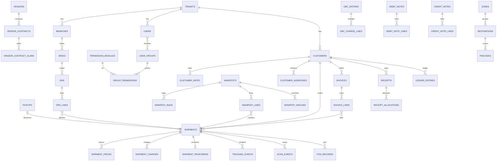

# Backend Blueprint — Part 1: PostgreSQL Database Design & Relationship Mapping

## 1. Global Conventions

Every business table follows this contract unless stated otherwise:

```sql
id              uuid PRIMARY KEY DEFAULT uuidv7(),      -- time-ordered UUID
tenant_id       uuid NOT NULL REFERENCES tenants(id),   -- tenant isolation (RLS anchor)
branch_id       uuid NULL REFERENCES branches(id),      -- owning service centre where applicable
created_at      timestamptz NOT NULL DEFAULT now(),
created_by      uuid NULL REFERENCES users(id),
updated_at      timestamptz NOT NULL DEFAULT now(),
updated_by      uuid NULL REFERENCES users(id),
deleted_at      timestamptz NULL,                        -- soft delete (NULL = live)
row_version     integer NOT NULL DEFAULT 1               -- optimistic locking
```

- **Soft delete:** UI does hard deletes; backend converts every delete to `deleted_at = now()`.
  Unique constraints are partial: `UNIQUE (...) WHERE deleted_at IS NULL`. Action-log reports
  require the tombstone plus an audit row.
- **Optimistic locking:** clients send `row_version`; `UPDATE ... WHERE row_version = $n`
  returning conflict (HTTP 409) on mismatch. Bump via trigger.
- **Tenant isolation:** RLS on every table: `USING (tenant_id = current_setting('app.tenant_id')::uuid)`.
  Composite indexes always lead with `tenant_id`.
- **Codes:** every master keeps the legacy `{code, name}` pair; code unique per tenant
  (`UNIQUE (tenant_id, code) WHERE deleted_at IS NULL`). FKs reference `id`, never code.
- **Status:** `status text NOT NULL DEFAULT 'ACTIVE' CHECK (status IN ('ACTIVE','INACTIVE'))`
  on masters that show the Active/In-Active pill.
- **Money:** `numeric(14,2)`; weights `numeric(12,3)`; percentages `numeric(7,4)`.
- **Enums:** Postgres `CHECK` constraints (not native enums) for evolvability; canonical values
  in UPPER_SNAKE, mapped to UI labels at the API layer.
- **Audit columns + audit trail:** row-level `created/updated` columns for convenience; the
  authoritative change history is `audit_logs` (Part 4 §4).

Denormalization policy: shipment rows carry snapshot copies of party names/addresses and
resolved codes (customer_code, destination_code, ...) so that historical documents don't
mutate when masters change — matched to how every report displays codes+names.

---

## 2. Table Catalog

### 2.1 Platform & tenancy

- **tenants** — SaaS tenant (courier company). `slug` (subdomain, unique), `name`, `short_name`,
  `logo_initials`, `support_email`, `support_phone`, `custom_domain`, `branding jsonb`
  (white-label), `status (ACTIVE|SUSPENDED|TRIAL|CLOSED)`, `plan_id FK`, `trial_ends_at`.
  No `tenant_id` column (root). Indexes: `UNIQUE(slug)`, `UNIQUE(custom_domain)`.
- **plans** — subscription plans: `code`, `name`, `price_monthly`, `price_yearly`, `currency`,
  `limits jsonb` (max_users, max_branches, max_shipments_month, storage_gb),
  `features jsonb` (feature flags: mobile_app, api_access, einvoice, whatsapp, ...).
- **tenant_subscriptions** — `tenant_id`, `plan_id`, `status (TRIALING|ACTIVE|PAST_DUE|CANCELLED)`,
  `current_period_start/end`, `payment_gateway_ref`. History kept (one row per period/change).
- **tenant_feature_overrides** — per-tenant flag overrides: `tenant_id`, `feature_key`, `enabled`, `config jsonb`.
- **usage_counters** — metering: `tenant_id`, `metric (shipments|storage_bytes|api_calls)`,
  `period (YYYY-MM)`, `value bigint`. `UNIQUE(tenant_id, metric, period)`.

### 2.2 Org structure

- **branches** (Service Centres) — `code`, `name`, `sub_name`, `address1..4`, `destination_id FK`,
  `state_id FK`, `state_code`, `pin_code`, `telephone`, `email`, `gst_no`, `pan_no`, `icn_no`, `st_no`,
  `company_logo_file_id`, `signatory_logo_file_id`, `terms text[]` (10 slots),
  bank fields (`bank_name, account_no, account_name, bank_address, ifsc, micr`),
  `is_head_office bool`, `branch_type (BRANCH|FRANCHISE|OTHER)` (report filter "Branch Type").
  `UNIQUE(tenant_id, code)`.
- **financial_years** — `tenant_id`, `branch_id NULL` (tenant-wide if null), `label`, `from_date`, `to_date`.
- **sequence_counters** — all document numbering: `tenant_id`, `branch_id NULL`,
  `doc_type (INVOICE|FREEFORM_INVOICE|DEBIT_NOTE|CREDIT_NOTE|RECEIPT|EXPENSE|MANIFEST|DRS|PICKUP|BAG_MANIFEST|OBC|AWB)`,
  `prefix`, `suffix`, `next_no bigint`, `fin_year_id NULL`.
  `UNIQUE(tenant_id, branch_id, doc_type, fin_year_id)`. Allocation: `UPDATE ... SET next_no = next_no + 1 RETURNING`
  inside the document-insert transaction (gapless per business requirement for invoices).

### 2.3 Identity, RBAC, sessions

- **users** — `username` (`UNIQUE(tenant_id, username)`), `password_hash` (argon2id), `user_type
  (ADMIN|USER|CUSTOMER)`, `customer_id NULL FK` (portal users), `email`, `mobile`, `birth_date`,
  `joining_date`, `status`, `application_type (ALL|MOBILE|PORTAL)`, `origin_destination_id`,
  `branch_id` (service centre), `weight_unit (KGS|LBS)`, `mfa_enabled bool`, `otp_login_enabled bool`,
  `flags jsonb` (add_entry_on_manifest, global_manifest, allow_changing_awb_no, mobile_app_lens,
  manifest_branch), `backdating_modules text[]` (Inscan, Manifest Scan, AWB Entry, DRS Scan, ...).
- **user_groups** — `name` (BS, OPERATION, Staff, ...). `UNIQUE(tenant_id, name)`.
- **user_group_members** — `user_id`, `group_id`. `UNIQUE(user_id, group_id)`.
- **user_branch_access** — branch scoping beyond home branch: `user_id`, `branch_id`, `is_default`.
- **permission_modules** — global seed (no tenant_id): `section (MASTERS|TRANSACTION|DOCUMENTS|REPORTS|UTILITIES|MOBILE)`,
  `slug`, `description`, `under_menu`, `sort`. ~169 rows seeded from the Access Rights screen.
- **group_permissions** — `tenant_id`, `group_id`, `module_id`, `all_access`, `can_add`,
  `can_modify`, `can_delete`, `can_list`, `can_search`. `UNIQUE(group_id, module_id)`.
- **sessions** — `user_id`, `tenant_id`, `refresh_token_hash`, `jti`, `ip_address`, `user_agent`,
  `channel (WEB|MOBILE|CUSTOMER)`, `login_at`, `last_seen_at`, `revoked_at`, `revoked_by`.
  Powers Logged-in Users screen + force logoff + Login Log report.
- **password_reset_tokens**, **otp_challenges** — standard.

### 2.4 Geo & serviceability masters

- **countries** — `code`, `name`, `weight_unit (KGS|LBS)`, `currency`, `isd_code`.
- **states** — `code`, `name`, `zone_id FK NULL`, `gst_alias`, `is_union_territory bool`.
- **zones** — `code`, `name` (domestic + international zones).
- **destinations** — `dest_type (DOMESTIC|INTERNATIONAL|LOCAL)`, `code`, `name`, `country_id`,
  `state_id NULL`, `service_type (REGULAR|METRO|REMOTE)`, `zone_id NULL`, `main_branch_id NULL`,
  `manifest_branch_id NULL`, `email`, `mobile`, `status`. Index `(tenant_id, dest_type, status)`.
- **pincodes** — `pin_code`, `pin_name`, `branch_id NULL` (service centre), `destination_id NULL`,
  `vendor_id NULL`, `zone_id NULL`, `state_id NULL`, `is_oda bool`, `is_serviceable bool`,
  `pickup_available bool`, `distance_km numeric`. `UNIQUE(tenant_id, pin_code)`;
  index `(tenant_id, is_serviceable, pin_code)`.
- **country_pincodes** — `country_id`, `pin_code`, `city_name`, `state_name`.
  `UNIQUE(tenant_id, country_id, pin_code, city_name)`.
- **areas** — `name` (upper), `branch_id`, `destination_id NULL`. `UNIQUE(tenant_id, branch_id, name)`.

### 2.5 Catalog masters

- **products** — `code`, `name`, `product_scope (DOMESTIC|INTERNATIONAL|LOCAL|IMPORT)`, `service`,
  `shipment_type (DOX|NDOX)`, `group_type (AIR|SURFACE|TRAIN|ALL)`, `fuel_charge_applies bool`,
  `gst_reverse bool`, `status`.
- **product_types**, **contents**, **instructions**, **industries**, **banks**, **flights**
  (`flight_type PRIME|GCR`) — simple `{code,name}+extras` masters.
- **airlines** — `name`, `product_id FK`.
- **sales_executives** — `code`, `name`, `commission_pct`.
- **field_executives** — `code`, `name`, `mobile`, `pickup_charge`, `delivery_charge`,
  `branch_id`, `destination_id`, `tld_batch_no`, `status`.
- **charge_definitions** (Charges Master) — `code`, `name`, `charge_type
  (AIRWAYBILL|EXPENSE|INCOME|OBC|PURCHASE)`, `base_on (ACTUAL_WEIGHT|CHARGE_WEIGHT|COD_AMOUNT|
  COMMERCIAL|FLAT|FREIGHT|MEDICAL|ODA|ODA1|ODA2|ODA3|PIECES|POINT|SHIPMENT_VALUE)`,
  `charge_rate`, `apply_fuel bool`, `apply_tax_on_fuel bool`, `apply_tax bool`, `hsn_code`,
  `sequence int`, `compound_of uuid[]` (multiple-charges composition).
- **expense_heads** — `code`, `name`, `kind (EXPENSE|INCOME)`, `expense_type
  (DIRECT|INDIRECT|OPERATIONAL|ADMINISTRATIVE)`, `ledger`, `gl_account`, `tax_pct`, `status`.
- **exceptions** — tracking status vocabulary: `code`, `name`, `outcome (DELIVERED|UNDELIVERED)`,
  `applies_to_inscan bool`, `show_on_mobile bool`.
- **service_types** — lookup (DOX, SPX, NDOX, ENV...).
- **contact_types** — mini master used by customer addresses.

### 2.6 Parties

- **customers** — profile: `code`, `name`, `contact_person`, `address1/2`, `pincode_id NULL`,
  `city`, `state_id NULL`, `billing_state_id`, `tel1`, `tel2`, `email`, `mobile`, `fax`,
  `branch_id` (service centre), `origin_destination_id`, `start_date`, `status`,
  `gst_no`, `aadhar_no`, `passport_no`, `pan_no`, `tan_no`, `dob_on_aadhar`,
  `customer_type (CUSTOMER|VENDOR|AGENT)` + report dimension `customer_class
  (CUSTOMER|CO_COURIER|FRANCHISEE)`, `register_type (B2B|B2C|SEZWP|SEZWOP)`, `invoice_format`,
  `signature_file_id`, `logo_file_id`.
  Billing: `payment_type (CASH|CHEQUE|CREDIT|TO_PAY)`, `billing_cycle (WEEKLY|FORTNIGHTLY|MONTHLY)`,
  `credit_limit`, `credit_days`, `credit_alert_pct`, `closing_balance`, `contract_head_id`,
  `ledger_head_id`, `contract_origin_destination_id`, `business_channel (DIRECT|RBP|RNP|WSP|RETAIL|CORPORATE|ECOM)`,
  `iec_no`, `bank_ad_code`, `bank_account`, `bank_ifsc`, `firm (GOVT|NON_GOVT)`,
  `lut_number`, `lut_issue_date`, `lut_till_date`, `shipper_type (INDIVIDUAL|COMPANY)`,
  `nfei bool`, `fuel_surcharge bool`, `tax bool`, `no_tariff bool`, `inclusive_tax bool`.
  Other: `sales_executive_id`, `incentive_type (PERCENTAGE|FLAT)`, `incentive_value`,
  `account_email`, `monthly_sales`, `default_vendor_id`, `area_id`, `field_executive_id`,
  `pickup_schedule jsonb` (mon..sun), `is_global bool`, `carrier_api (DTDC|BLUEDART|FEDEX|...)`,
  `measurement_unit (CM|INCH)`, `industry_id`, `geo_location`, feature checkboxes jsonb,
  `notification_prefs jsonb` (email_forwarding, email_progress, e_statement, e_invoice,
  whatsapp_*, allow_zero_amount, ...), `portal_username`, `portal_password_hash`, `otp_login bool`.
- **customer_addresses** — child contacts/addresses: `customer_id`, `contact_type_id`,
  `from_date`, `name`, `designation`, `email`, `mobile`, `landline`, `extension`,
  `address1..3`, `pincode_id`, `city`, `state_id`, `country_id`, `remark`,
  `passport_no`, `aadhar_no`, `gst_no`, `pan_no`, `iec_no`, `ad_code`, `lut_no`,
  `is_default_shipper bool`, `kyc_file_id`.
- **customer_volumetrics** — `customer_id`, `product_id NULL`, `vendor_id NULL`, `service`,
  `cm_divisor`, `inch_divisor`, `cft numeric`.
- **kyc_documents** — polymorphic: `owner_type (CUSTOMER|SHIPPER|CONSIGNEE|SHIPMENT|VENDOR)`,
  `owner_id uuid`, `kyc_type (AADHAAR|DL|GSTIN|IEC|PAN|PASSPORT|TAN|VOTER_ID|OTHER)`,
  `file_id`, `entry_date`, `sent_at NULL`. Index `(tenant_id, owner_type, owner_id)`.
- **consignees / shippers** — mirrored address books: `code`, `name`, `customer_id NULL`,
  `mobile`, `email`, `address`, `pincode_id`, `city`, `state_id`, `country_id`, `status`.
- **vendors** — `code`, `name`, `contact_person`, `address1/2`, `pincode_id`, `city`, `state_id`,
  `phone1`, `phone2`, `fax`, `mobile`, `email`, `website`, `gst_no`,
  `mode (AIR|SURFACE|TRAIN|COURIER|EXPRESS)`, `vendor_class (OBC|DELIVERY|VENDOR|AIRLINE)`,
  `fuel_head_id (ledger)`, `currency`, `origin_destination_id`, `vendor_zip`,
  `is_global bool`, `gst_applies bool`, `vol_weight_round_off bool`, `status`.

### 2.7 Rating & tax

- **customer_rates** — `customer_id`, `product_id`, `service`, `origin_destination_id NULL`,
  `destination_id NULL`, `zone_id NULL`, `from_date`, `to_date`, `min_weight`, `rate_per_kg`,
  `fuel_pct`, `other_charges`, `status`. Index `(tenant_id, customer_id, product_id, from_date DESC)`.
- **vendor_contracts** — header: `vendor_id`, `contract_no`, `from_date`, `origin_destination_id`,
  `product_id`, `zone_id NULL`, `country_id NULL`, `destination_id NULL`, `service`,
  `unit (KG|LB|CBM|PIECE)`, `transit_days`.
- **vendor_contract_slabs** — `contract_id`, `rate_type (FLAT|PER_KG|PER_SLAB|MINIMUM)`,
  `weight numeric`, `rate numeric`. (UI creates one listing row per slab.)
- **zone_mappings** — routing/rating zone resolution: `origin_destination_id NULL`, `vendor_id NULL`,
  `service`, `product_id NULL`, `country_id NULL`, `destination_id NULL`, `zone_id`,
  `effective_date`. Bulk import/export via Zone Update utility.
- **fuel_surcharge_rates** — `entry_code`, `customer_id NULL`, `vendor_id NULL`, `product_id NULL`,
  `destination_id NULL`, `service_type_id NULL`, `from_date`, `to_date`, `percentage`.
  Resolution: most-specific match wins at rating time; customer-level child rows come from the
  customer wizard tab, global rows from Fuel Setup.
- **tax_rates** — `customer_id NULL`, `product_id NULL`, `from_date`, `to_date`,
  `igst_pct`, `cgst_pct`, `sgst_pct`. Inter/intra-state selection: compare customer
  `billing_state` with branch state → IGST vs CGST+SGST.
- **customer_other_charges** — `customer_id`, `charge_definition_id NULL`, `charge_type`,
  `from_date`, `to_date`, `vendor_id`, `service`, `product_id`, `origin_destination_id`,
  `destination_id`, `amount`, `minimum_value`.

### 2.8 Operations — booking to delivery

- **pickups** — `pickup_no bigint` (per-tenant seq), `customer_id NULL`, `pickup_date`,
  `pickup_time`, `origin_destination_id`, `mobile_no`, `shipper_id NULL`, `shipper_name`,
  `contact`, `address1/2`, `zip`, `city`, `state`, `pay_option`, `consignee_details bool`,
  `branch_id`, `vehicle_type (BICYCLE|BIKE|CAR|VAN|TRUCK|TEMPO)`, `area_id`, `field_executive_id NULL`,
  `sales_executive_id NULL`, `special_instructions`, `reason`, `pickup_ready bool`,
  `status (OPEN|ASSIGNED|PICKED|CONFIRMED|CANCELLED)`, `awb_id NULL`, `booked_by`, `edited_by`.
  Indexes: `(tenant_id, branch_id, pickup_date)`, `(tenant_id, status)`.
- **shipments** (AWB — the central table) —
  identity: `awb_no` (`UNIQUE(tenant_id, awb_no) WHERE deleted_at IS NULL`), `book_date`,
  `book_time`, `reference_no`, `customer_id`, `branch_id` (booking service centre),
  `origin_destination_id`, `destination_id`;
  parties (snapshot jsonb or flattened columns): `shipper jsonb`, `consignee jsonb`
  (name, address1/2, pincode, city, state, phones, email, country, iec_no, document_type/no);
  service: `product_id`, `vendor_id NULL`, `airline`, `service`, `flight_no`,
  `payment_type`, `product_scope`, `content_id NULL`, `instruction_id NULL`,
  `field_executive_id NULL`, `pickup_id NULL`;
  weights: `pieces int`, `pieces_unit (DOX|NDOX|ENV)`, `actual_weight`, `weight_unit`,
  `vol_weight`, `charge_weight`, `measurement_unit`, `inscan_weight NULL`;
  value & flags: `shipment_value`, `currency`, `is_commercial`, `is_oda`, `medical_charges`,
  `csb_type NULL`, `cod_amount NULL`, `eway_bill_no NULL`;
  money: `customer_charges_total`, `vendor_charges_total`, `fuel_amount`, `tax_amount`,
  `grand_total`, `cash_receipt_no`, `amount_received`, `balance_amount`, `cash_receipt_date`;
  links: `manifest_id NULL`, `bag_id NULL`, `drs_id NULL`, `invoice_id NULL`,
  `debit_note_id NULL`, `credit_note_id NULL`;
  forwarding: `forwarding_awb`, `delivery_awb`, `return_awb`, `delivery_vendor_id NULL`,
  `delivery_service`, `master_awb_no`, `cd_no`, `obc_id NULL`;
  state: `current_status` (see Part 4 state machine), `status_at timestamptz`,
  `pod_status NULL`, `pod_date`, `pod_receiver`, `pod_remark`, `delivered_at NULL`,
  `is_hold bool`, `hold_remark`, `is_locked bool` (billing lock), `is_void bool`, `is_rto bool`;
  audit: `awb_user_id`, `pod_user_id`.
  Indexes: `(tenant_id, book_date)`, `(tenant_id, customer_id, book_date)`,
  `(tenant_id, current_status)`, `(tenant_id, destination_id, current_status)`,
  `(tenant_id, forwarding_awb)`, `(tenant_id, reference_no)`, trigram on consignee name (search).
- **shipment_pieces** — `shipment_id`, `child_awb`, `actual_weight_per_pc`, `pieces`,
  `length`, `breadth`, `height`, `divisor`, `vol_weight`, `charge_weight`.
  Rule: `vol_weight = L*B*H*pcs/divisor` (5000 cm / 139 inch or customer override);
  `charge_weight = GREATEST(vol_weight, actual*pcs)`.
- **shipment_charges** — one row per charge line, both sides:
  `shipment_id`, `side (CUSTOMER|VENDOR)`, `charge_definition_id NULL`, `description`,
  `rate`, `amount`, `fuel_applies bool`, `fuel_amount`, `tax_applies bool`, `tax_on_fuel bool`,
  `igst`, `sgst`, `cgst`, `total`, `charges_type (MANUAL|SYSTEM)`.
- **shipment_proformas** — `shipment_id`, `csb_type`, `incoterm`, `gst_invoice`, `invoice_no`,
  `invoice_date`, `department_no`, `export_reason`, `format (B2B|B2C|C2C)`, `currency`.
- **shipment_proforma_lines** — `proforma_id`, `box_no`, `packages`, `description`, `hs_code`,
  `quantity`, `weight`, `unit (PCS|KGS|NOS|SET|PAIR)`, `rate`, `amount`, `igst_pct`, `igst_amount`.
- **manifests** — outbound & bagging unified: `manifest_no text` (formatted),
  `manifest_kind (OUTBOUND|BAGGING|OBC)`, `manifest_date`, `manifest_time`,
  `to_type (SERVICE_CENTER|THIRD_PARTY)`, `to_branch_id NULL`, `vendor_id NULL`,
  `origin_branch_id`, `location_code`, `connect_station`, `master_awb_no`, `cd_no`, `edi_master_no`,
  `flight1`, `flight2`, `departure`, `arrival`, `arrival_airport`, `arrival_date`,
  `origin_city`, `origin_country_id`, `dest_city`, `dest_country_id`, `airline_code`,
  `total_bags int`, `vendor_weight`, `reference_no`, `remark`, `obc_name`,
  `status (OPEN|DISPATCHED|ARRIVED|CLOSED)`, `is_locked bool`.
  `UNIQUE(tenant_id, manifest_no)`.
- **manifest_bags** — `manifest_id`, `bag_no`, `crn_mhbs_no`, `weight`, `pieces`.
- **manifest_lines** — `manifest_id`, `bag_id NULL`, `shipment_id`, `forwarding_no`,
  `weight`, `pieces`, `added_at`, `added_by`. `UNIQUE(manifest_id, shipment_id)` — duplicate-scan guard.
- **manifest_inscans** — receipt events: `manifest_id NULL`, `manifest_no text`, `bag_no`,
  `shipment_id NULL`, `awb_no`, `scan_date`, `scan_time`, `branch_id`, `mode (BAG|AWB)`,
  `pieces`, `weight`, `length`, `breadth`, `height`, `vol_weight`, `remark`,
  `use_booking_weight bool`, `variance (NONE|SHORT|EXCESS)`.
- **drs** (delivery run sheets) — `drs_no`, `drs_date`, `drs_time`, `area_id`, `area_seq`,
  `field_executive_id NULL`, `branch_id`, `remark`, `status (OPEN|DISPATCHED|CLOSED)`.
- **drs_lines** — `drs_id`, `shipment_id`, `eway_bill_no`, `shipment_value`, `outcome NULL
  (DELIVERED|UNDELIVERED)`, `outcome_at`. `UNIQUE(drs_id, shipment_id)`.
- **obc_entries** — `obc_no`, `cd_no`, `pay_type`, `obc_vendor_id`, `product_id`,
  `origin_destination_id`, `destination_id`, `flight`, `book_date`, `book_time`,
  `mawb_no`, `delivery_vendor_id`, `obc_service`, `master_eawb`, `is_locked`,
  consignee snapshot jsonb, `bag_dox int`, `bag_nondox int`, `actual_weight`, `charge_weight`,
  totals (`ebt_amount, other_charges, surcharge, igst, cgst, sgst, grand_total`).
- **obc_charge_lines** — same shape as `shipment_charges`.
- **obc_manifest_links** — `obc_id`, `manifest_id`.
- **transfer_runs** — `mode (TRANSFER|OFFLOAD)`, `source_manifest_id`, `dest_manifest_id NULL`,
  `keep_original_bag_no bool`, `executed_by`, `executed_at`.
- **scan_events** — unified operational scans (append-only, partitioned by month):
  `shipment_id`, `awb_no`, `scan_type (PICKUP_INSCAN|MANIFEST_OUT|MANIFEST_IN|BAGGING|DRS|
  UNDELIVERED|MISSROUTE|HUB|POD)`, `scan_date`, `scan_time`, `branch_id`, `user_id`,
  `device (WEB|MOBILE)`, `ref_table`, `ref_id`, `payload jsonb`.
- **tracking_events** — customer-visible progress timeline (append-only, partitioned):
  `shipment_id`, `event_date`, `event_time`, `branch_id`, `exception_id NULL`,
  `status_text`, `remark`, `user_id`, `source (SYSTEM|MANUAL|CARRIER_API|IMPORT)`.
- **shipment_comments** — `shipment_id`, `comment`, `file_id NULL`, `user_id`, `commented_at`.
- **shipment_holds** — `shipment_id`, `action (HOLD|RELEASE)`, `remark`, `shipper_email`,
  `mail_sent bool`, `user_id`, `at`.
- **pod_records** — `shipment_id`, `pod_date`, `receiver_name`, `remark`,
  `status (DELIVERED|IN_TRANSIT|PENDING)`, `signature_file_id NULL`, `photo_file_id NULL`,
  `source (DRS|IMPORT|MOBILE|MANUAL)`.

### 2.9 Finance

- **invoices** — (implied module) `invoice_no` (from sequence_counters, gapless), `invoice_date`,
  `customer_id`, `branch_id`, `period_from/to`, `register_type (B2B|B2C|SEZWP|SEZWOP)`,
  `sub_total`, `fuel_total`, `other_total`, `igst`, `cgst`, `sgst`, `grand_total`,
  `status (DRAFT|GENERATED|FINALISED|CANCELLED)`, `is_locked`, `irn`, `irn_status
  (PENDING|GENERATED|CANCELLED)`, `irn_payload jsonb`, `qr_code`.
- **invoice_lines** — `invoice_id`, `shipment_id`, amount/tax breakdown snapshot.
- **receipts** — `receipt_no`, `receipt_date`, `customer_id`, `branch_id`, `bank_id NULL`,
  `mode (CASH|BANK)`, `amount`, `narration`, `status (POSTED|ADJUSTED|CANCELLED)`.
- **receipt_allocations** — receipt→invoice adjustment (permission "Receipt Adjustment"):
  `receipt_id`, `invoice_id`, `amount`.
- **expense_entries** — `entry_no`, `kind (EXPENSE|INCOME)`, `entry_date`, `expense_head_id`,
  `mode (CASH|BANK)`, `shipment_id NULL`, `description`, `amount`, `document_file_id NOT NULL`,
  `authorization_status (UNAUTHORIZED|AUTHORIZED|REJECTED)`, `authorized_by NULL`, `authorized_at`.
- **debit_notes / credit_notes** — `note_no`, `note_date`, `customer_id`, `invoice_id NULL`,
  `narration`, `gst_applies bool`, `register_type`, totals (`amount, igst, sgst, cgst, grand_total`),
  `irn`, `irn_status`, `approval_on_einvoice bool`, `status (DRAFT|POSTED|CANCELLED)`.
- **debit_note_lines / credit_note_lines** — `note_id`, `shipment_id`, `remark`, `amount`,
  `igst`, `sgst`, `cgst`, `total` (+ snapshot: destination, product, weight, pcs).
- **customer_payments** — customer-declared: `customer_id`, `declared_date`, `paid_date`,
  `amount`, `remark`, `file_id NULL`, `status (PENDING|APPROVED|REJECTED)`, `reviewed_by/at`.
- **ledger_entries** — AR subledger (source of AR reports & statements):
  `customer_id`, `entry_date`, `doc_type (INVOICE|RECEIPT|DEBIT_NOTE|CREDIT_NOTE|ADJUSTMENT|OPENING)`,
  `doc_id`, `debit`, `credit`, `balance_after`, `branch_id`.
  Index `(tenant_id, customer_id, entry_date)`.

### 2.10 Settings, notifications, jobs, files, audit

- **tenant_settings** — `scope (TENANT|BRANCH)`, `branch_id NULL`, `key`, `value jsonb`.
  Holds: entry_lock_date, credit_alert_pct, invoice counters (migrating to sequence_counters),
  form-setup flag sets per module (AWB Entry 24, ManifestScan 33, PickupInscan 28, AWB Query 10,
  DRS 16, Pickup 5, RCP 6), volumetric divisors, awb prefix, email footer regards.
- **email_configs** — per email module (FORWARDING|PROGRESS|ESTATEMENT|WEIGHT_ALERT|KYC|FOOTER):
  smtp host/port/ssl, from, auth user, encrypted password, subject/body templates (48 merge
  tokens), schedule fields, print flags jsonb.
- **notifications** — broadcast: `notify_date`, `notify_time`, `audience (CUSTOMER|USER)`,
  `message`, `created_by`. Plus **user_notifications** (per-user inbox for the header bell):
  `user_id`, `title`, `body`, `link`, `read_at`.
- **report_jobs** — async report queue: `report_key`, `params jsonb`, `status
  (QUEUED|RUNNING|DONE|FAILED)`, `file_id NULL`, `error`, `requested_by`, timings.
- **import_jobs** — `import_type (AWB_MERGE|POD_MERGE|FORWARDING_MERGE|AWB_STOCK|OTHER_CHARGES|
  DATA_UPDATE|RATE_IMPORT|ZONE_IMPORT|MASTER_CSV)`, `format`, `params jsonb`, `file_id`,
  `status`, `total_rows`, `ok_rows`, `error_rows`, `requested_by`.
- **import_row_errors** — `job_id`, `row_no`, `column_name`, `message`, `raw jsonb`.
- **rate_update_jobs** — `update_type (AWB_RATE|VENDOR_RATE|TAX_FUEL|OBC_RATE)`, filter snapshot
  jsonb, `status`, counters (updated/skipped_locked).
- **files** — object-storage metadata: `storage_key`, `original_name`, `mime`, `size_bytes`,
  `sha256`, `scan_status (PENDING|CLEAN|INFECTED)`, `owner_type`, `owner_id`, `uploaded_by`.
- **audit_logs** — append-only, monthly partitions: `entity_type`, `entity_id`, `action
  (ADD|MODIFY|DELETE)`, `module_slug`, `user_id`, `at`, `old_values jsonb`, `new_values jsonb`,
  `ip`, `request_id`. Feeds all 31 Action Log reports.
- **api_logs**, **webhooks**, **webhook_deliveries**, **integration_credentials** — Part 4.

---

## 3. ER Diagram (core operational spine)



## 4. Referential-integrity & cascade policy

- **RESTRICT (default) on all master FKs** referenced by transactions (customer, vendor, product,
  destination, branch...): masters with usage cannot be hard-deleted; UI delete → soft delete.
- **CASCADE only parent→child within one aggregate:** shipment→pieces/charges/proforma lines,
  manifest→bags/lines, drs→lines, note→lines, import_job→row_errors.
- **SET NULL** for optional operational links whose parent may be voided (shipment.manifest_id,
  shipment.drs_id) — history preserved in scan_events/manifest_lines.
- **No cross-tenant FKs by construction:** RLS + composite `(tenant_id, id)` uniqueness checks in
  service layer; optionally enforce with composite FKs on hot tables (`manifest_lines(tenant_id,
  shipment_id) REFERENCES shipments(tenant_id, id)`).

## 5. Data ownership

- Tenant owns everything below it; branch ownership recorded on operational documents
  (`branch_id`) for branch-scoped visibility (users see home branch + `user_branch_access`).
- Masters are tenant-wide (not branch-scoped) except: areas, financial voucher counters,
  local-branch profile — branch-scoped.
- Platform tables (plans, permission_modules) are global (no tenant_id).

## 6. Partitioning & growth plan

- `scan_events`, `tracking_events`, `audit_logs`, `api_logs`: **range partition by month**;
  detach/archive partitions older than retention (24 months hot, then cold storage).
- `shipments`: start unpartitioned with tight indexes; when a tenant fleet exceeds ~50M rows,
  move to hash-by-tenant or range-by-book_date partitioning (design keeps all access paths
  tenant_id-leading so the migration is transparent).
- Materialized rollups for dashboards/reports: `daily_branch_stats(tenant_id, branch_id, date,
  bookings, pickups_pending, in_transit, delivered, revenue)` refreshed incrementally (Part 4).
