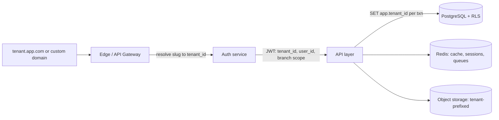

# Backend Blueprint — Part 2: Multi-Tenancy, Authentication, Authorization, Security, Performance

## 1. Multi-Tenant Architecture

### 1.1 Model: shared database, shared schema, row-level security

One PostgreSQL cluster, one schema, `tenant_id` on every business row, enforced by RLS.
Chosen over schema-per-tenant / DB-per-tenant because the target is *thousands* of small-to-mid
courier companies: cheap onboarding, uniform migrations, cross-tenant platform analytics.
Escape hatch: the design keeps every query tenant_id-leading, so a very large tenant can later be
moved to a dedicated database with no application changes (routing by tenant in the connection layer).

### 1.2 Tenant resolution

- Primary: subdomain (`<slug>.app.com`) — matches the existing frontend convention; custom
  domains supported via `tenants.custom_domain` (white-label ready).
- The JWT carries `tenant_id`; the API additionally validates that the token's tenant matches
  the host-resolved tenant (defense against token replay across tenants).
- Every DB transaction begins with `SET LOCAL app.tenant_id = '<uuid>'` (and `app.user_id`);
  RLS policies key off these. App connects as a non-superuser role without `BYPASSRLS`.

### 1.3 Scoping hierarchy

- **Tenant (Company)** → **Branch (Service Centre)** → **User**.
- Operational documents carry `branch_id`; users see their home branch plus rows granted via
  `user_branch_access`. `global_manifest` / `is_global` user flags widen visibility.
- Office/Department: not present in the frontend — modeled by keeping `branch_id` + user groups;
  add an `org_units` table later if needed (noted as gap, not built now).
- **Access tiers:** Super Admin (platform staff; cross-tenant via separate admin API + audited
  impersonation), Tenant Admin (userType ADMIN), Branch users (scoped), Customer portal users
  (`user_type = CUSTOMER`, locked to their `customer_id` rows).

### 1.4 Subscription plans & feature flags

- `plans.features` gates modules server-side (middleware rejects, UI hides): mobile app, e-invoice,
  WhatsApp, carrier APIs, report job queue size, API access.
- `plans.limits` metered against `usage_counters` (shipments/month, users, branches, storage).
  Soft-warn at 80%, hard-block per policy at 100% (configurable).
- `tenant_feature_overrides` for bespoke deals.

### 1.5 Storage & API isolation

- Object storage keys: `tenants/{tenant_id}/{module}/{uuid}` — signed URLs only, no public bucket.
- Per-tenant API rate limits (Redis token bucket keyed `tenant:route`), per-user sub-limits.
- Report/import job queues fair-share by tenant to prevent noisy-neighbor starvation.

---

## 2. Authentication

- **Staff login:** username + password (argon2id), per-tenant username uniqueness. Password
  policy from User Setup screen: min 8 chars, ≥1 special, ≥1 numeric, username ≠ password;
  add: history of 5, lockout after 5 failures (15 min), expiry configurable per tenant.
- **OTP login:** `otp_login_enabled` per user (and per customer) — SMS/email OTP challenge flow.
- **MFA-ready:** TOTP secret fields on users; enforcement flag per tenant/plan.
- **Customer portal:** same `users` table with `user_type = CUSTOMER`, `customer_id` set; separate
  login route + narrower token scope.
- **Tokens:** short-lived access JWT (15 min) + rotating refresh token (7–30 days, hashed in
  `sessions`). JWT claims: `sub`, `tenant_id`, `user_type`, `branch_id`, `jti`, `app (WEB|MOBILE)`.
  Permissions are **not** embedded in the JWT (matrix too large, must be revocable live) —
  resolved server-side per request from a Redis-cached permission set, invalidated on
  access-rights save.
- **Session management:** `sessions` table powers the Logged-in Users screen; force logoff =
  revoke refresh token + add `jti` to a Redis denylist until access-token expiry. All logins,
  logouts, and forced logoffs recorded in `login_logs` (Login Log report needs user type,
  IP, date/time).

## 3. Authorization (RBAC)

### 3.1 Permission model (directly from the Access Rights screen)

- `permission_modules`: ~169 seeded modules across 6 sections (Masters 31, Transaction 54,
  Documents 6, Reports 47, Utilities 18, Mobile 13).
- `group_permissions`: per group × module → `all_access, add, modify, delete, list, search`.
- Effective permission = OR across the user's groups; `all_access` implies all five actions.
- **Button/field-level permissions** exist as *modules themselves* (e.g. "Freight Amount Edit",
  "Allow Modify Delivered Entry", "Invoice Cancel After IRN Generated", "AWB Hold Unhold",
  "Allow Invoice Date To Change") — the middleware exposes `hasPermission(slug, action)` and
  handlers check these before applying protected mutations.
- **User-level feature flags** (User Setup) are additional constraints layered on top:
  backdating per module (`backdating_modules`), allow_changing_awb_no, global_manifest,
  add_entry_on_manifest, weight unit, application_type (routes MOBILE vs PORTAL APIs).

### 3.2 Enforcement layers

1. **Route middleware:** `requireAuth` → `requireTenant` → `requirePermission(module, action)`.
2. **Row scope:** RLS (tenant) + service-layer branch filter (branch_id ∈ user's branches unless global).
3. **Field guards:** protected fields (freight amount, invoice date, AWB no on edit) validated
   against specific permission slugs; violations return 403 with the missing slug.
4. **Menu API:** `GET /me/navigation` returns the nav tree filtered by `can_list` — the sidebar
   should render from this, not the static config.
5. **Approval permissions:** expense authorize, customer payment review, invoice finalise,
   IRN generation are distinct slugs (maker-checker: creator ≠ authorizer enforced in service).

### 3.3 Permission matrix summary

- Sections → CRUDLS flags per group. Seed three groups per tenant on provisioning:
  `TENANT_ADMIN` (all), `OPERATIONS` (transaction+reports), `ACCOUNTS` (finance+reports).
- Reports use `can_list`/`can_search`; exports additionally gated by an `export` convention
  (reuse `can_search` + plan feature flag).

---

## 4. Security Review (design commitments)

- **SQL injection:** parameterized queries only (query builder/ORM); report filter engine builds
  from a whitelist of filter keys → column mappings, never string concatenation.
- **Tenant isolation / IDOR:** RLS as the last line; all lookups by `id` are `WHERE tenant_id = ...`
  even above RLS; object storage access only via signed URLs generated after permission check;
  IDs are UUIDv7 (non-enumerable).
- **Broken access control:** permission slugs enforced server-side (never trust hidden UI);
  integration tests assert 403 matrix per role for every route.
- **XSS/CSRF:** API is JSON + Bearer tokens (no cookies for API) → CSRF-immune; if cookies used
  for SSR session, SameSite=Lax + CSRF token. All user content escaped by React; sanitize
  rich text (comments) server-side.
- **Rate limiting:** per-IP on auth endpoints (brute force), per-tenant/user on API; scan
  endpoints get higher budgets.
- **Secrets:** SMTP passwords, carrier API keys, payment keys in `integration_credentials`
  encrypted with envelope encryption (KMS master key); never returned by APIs (write-only).
- **Encryption:** TLS everywhere; at-rest via managed PG encryption; PII columns (aadhar_no,
  passport_no, pan_no) — application-level encryption + masked display permission.
- **PII & compliance:** KYC docs access-logged; retention policy per doc type; DPDP/GDPR-ready
  export & erasure endpoints per customer; audit logs immutable (append-only, no UPDATE grant).
- **Uploads:** MIME + extension whitelist, size caps, antivirus scan before serving
  (`files.scan_status`), images re-encoded.
- **Headers:** HSTS, CSP on the app shell, X-Content-Type-Options.

---

## 5. Performance & Scalability

- **Connection pooling:** PgBouncer (transaction mode) in front of PG; pool per service.
  Note: RLS `SET LOCAL` pattern is pooling-safe (transaction-scoped).
- **Redis:** permission cache, lookup cache (masters change rarely; bust on write), rate limits,
  session denylist, job queues (BullMQ or equivalent).
- **Caching strategy:** lookups (`/lookups/{key}`) cached 60s server-side + ETag; dashboard from
  `daily_branch_stats` rollup; report results streamed to files, never buffered in memory.
- **Indexes:** every list endpoint's filterable columns get composite indexes leading with
  `tenant_id`; trigram (pg_trgm) indexes for name searches (customer, consignee, destination);
  partial indexes for hot statuses (`WHERE current_status IN (...) AND deleted_at IS NULL`).
- **Pagination:** keyset pagination for big tables (shipments, events) with offset fallback for
  small masters; server max page size 200.
- **Heavy work off the request path:** report generation, imports, rate recalculation, EDI/CSB
  files, label/PDF rendering, emails — all queued (Part 4 §3).
- **Partitioning:** monthly for event/audit/log tables (Part 1 §6).
- **Horizontal scaling:** stateless API (JWT + Redis), scale by replica; read replicas for
  reporting when needed (report engine tagged read-only).
- **N+1 discipline:** list endpoints return snapshot/denormalized columns (already designed into
  shipments) rather than joining 10 masters per row.
