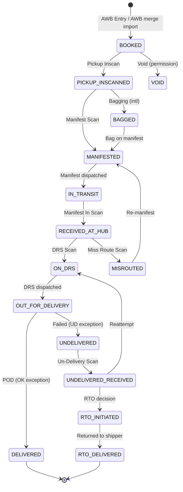

# Backend Blueprint — Part 4: Workflows, Reporting, Background Services, Audit, Files, Integrations

## 1. Workflow State Machines

### 1.1 Shipment (AWB) lifecycle — the operational spine

Rules:

- Every transition writes a `tracking_event` (customer-visible) and/or `scan_event` (operational),
  both append-only. `shipments.current_status` is a denormalized pointer maintained in the same txn.
- Transition guards: duplicate scan (409/422), HOLD blocks DRS assignment and delivery until
  RELEASE, `is_locked`/entry-lock-date blocks edits, delivered shipments immutable unless
  "Allow Modify Delivered Entry" permission, progress-on-delivered gated by `allowIfDelivered`
  + permission.
- Exception master classifies terminal outcome (DELIVERED vs UNDELIVERED); POD OK update sets
  `pod_status`, receiver, date.
- Status timestamps power Entry-vs-Scan reconciliation reports.

### 1.2 Pickup

`OPEN → ASSIGNED (FE set) → PICKED (AWB linked) → CONFIRMED | CANCELLED`; registers = queries on
these states. Transfer moves ASSIGNED pickups between FEs (bulk, by date).

### 1.3 Manifest

`OPEN (scanning) → DISPATCHED (departure recorded) → ARRIVED (first inscan) → CLOSED (reconciled)`;
short/excess variance computed as lines vs inscans; transfer-run mutates OPEN manifests only.

### 1.4 DRS

`OPEN → DISPATCHED → CLOSED` (closed when all lines have outcome or are pulled back).

### 1.5 Finance workflows

- **Expense:** `UNAUTHORIZED → AUTHORIZED | REJECTED` (maker-checker; edit blocked after).
- **Customer payment:** `PENDING → APPROVED | REJECTED`.
- **Invoice:** `DRAFT → GENERATED → FINALISED → (IRN GENERATED) → CANCELLED?`; lock/unlock
  toggles edit; cancel-after-IRN is its own permission; finalised invoices post to
  `ledger_entries`.
- **Debit/Credit note:** `DRAFT → POSTED → CANCELLED`; IRN sub-state `PENDING → GENERATED → CANCELLED`;
  posting writes ledger entries (debit note = debit customer, credit note = credit).
- **Receipt:** `POSTED → ADJUSTED (allocations) → CANCELLED`; posts credit to ledger.

### 1.6 Rating pipeline (booking & billing time)

1. Resolve lane: origin/destination (+pincode ODA) → zone via `zone_mappings`.
2. Customer rate: date-effective `customer_rates` (most specific lane match) → base freight.
3. Charge lines: applicable `charge_definitions` + `customer_other_charges` (base_on logic).
4. Fuel: `fuel_surcharge_rates` (most specific match, date-effective) on fuel-applicable lines.
5. Tax: `tax_rates` (customer+product, date) → IGST vs CGST+SGST by state comparison;
   tax-on-fuel flag honored.
6. Vendor cost mirror: `vendor_contracts` slabs (FLAT|PER_KG|PER_SLAB|MINIMUM) + vendor fuel/tax.
7. Persist snapshot into `shipment_charges`; recalculation only via rate-update jobs which skip
   locked/invoiced docs.

## 2. Reporting Layer

- **Report registry:** `report_definitions` seeded from the 5 hub configs (~74 reports):
  key, hub, filter schema (typed: date-range≤31d, lookups, enums, toggles), output columns,
  allowed formats, permission slug.
- **Engine:** filter-schema-driven SQL builder over read-optimized sources:
  - Operational reports (DRS, manifest, undelivery, MIS, OK delivery, scan recon): `shipments`
    + `tracking_events`/`scan_events` joins, details vs summary via GROUP BY switch.
  - Financial (billing, invoice register, GST, tax, cash collection, profit): `invoices`,
    `shipment_charges`, `ledger_entries`.
  - AR (ageing, outstanding, details): `ledger_entries` with ageing buckets; "as-on-date"
    replays balance.
  - Audit (31 Action Log variants): `audit_logs` filtered by module slug + action.
  - Session (login log, user analysis, entry log): `login_logs`, `audit_logs`.
- **Performance strategy:** 31-day range cap enforced server-side; composite indexes per hub's
  filter set; `daily_branch_stats` + `daily_customer_stats` materialized rollups (refreshed
  incrementally by events) back the summary variants and dashboard; anything projected > N rows
  or PDF/Excel export runs as a queued `report_job` writing to object storage.
- **Exports:** CSV/XLSX streamed; PDF/Label via headless render service; GST register + EDI CSB
  (III/IV/V) as dedicated formatters; email delivery option.

## 3. Background Services (queues; all tenant-fair-share)

- **report-jobs** — async report generation → file → notify requester.
- **import-jobs** — Excel/CSV pipelines (AWB merge with inscan/pickup side-effects, POD merge,
  forwarding merge, stock, other charges, rate import, zone import, master CSVs); row-level
  error capture; chained jobs (rate import → rate update).
- **rate-jobs** — bulk recalculation (skips locked), respects filters snapshot.
- **notify-email** — SMTP per tenant email_configs: forwarding info, progress, e-statement
  (scheduled), weight alert, credit-limit alert (threshold %), invoice/IRN mails; template
  merge with the 48 e-statement tokens.
- **notify-sms / notify-whatsapp** — OTP, delivery notifications (customer prefs flags).
- **carrier-sync** — poll/push carrier APIs (32 vendor links: FEDEX, DHL, BLUEDART, DTDC...):
  push bookings, pull tracking → `tracking_events` (source=CARRIER_API).
- **webhook-dispatch** — signed deliveries, exponential backoff (1m/5m/30m/2h/6h, max 5), DLQ.
- **scheduled:** daily rollup refresh, e-statement scheduler, session sweeper, retention/cleanup
  (logs, temp files), usage metering aggregation, subscription billing cycle, DB backup checks.
- **irn-jobs** — e-invoice (IRP) generation/cancellation with retry + manual-review queue.

## 4. Audit & Logging

- **audit_logs** (Part 1) — every ADD/MODIFY/DELETE on audited entities via service-layer
  interceptor: old/new value jsonb diff, user, IP, module slug, request id. Feeds the 31 Action
  Log reports (each report = filter on module slug). Append-only; monthly partitions;
  no UPDATE/DELETE grants.
- **login_logs** — login/logout/forced-logoff/failed attempts with user type, channel, IP.
- **api_logs** — request metadata (route, status, latency, tenant, user, request id) — to a
  logging pipeline (structured logs), sampled body capture for mutations only.
- **permission change log** — access-rights saves audited with full grant diff.
- **error/security logs** — structured app logs + alerting (repeated 403s, cross-tenant
  attempts, rate-limit hits).
- **Record history API:** `GET /audit/:entityType/:id` → chronological who/when/old/new.

## 5. File Management

- Uploads discovered: customer logo/signature, KYC docs (customer/shipper/consignee/AWB),
  vendor rate files, contract rate files, expense documents (mandatory), customer payment
  proofs, comment attachments, all Excel imports, branch logos.
- **Storage:** S3-compatible, key `tenants/{tenantId}/{module}/{yyyy}/{uuid}-{slugified-name}`;
  metadata in `files`.
- **Flow:** `POST /files` (validated: whitelist, size cap) → AV scan queue → CLEAN before any
  signed GET; INFECTED quarantined + alert.
- **Access:** signed URLs (15 min) issued only after entity-level permission check; every
  KYC access audit-logged.
- **Versioning:** new upload = new file row linked to owner; prior rows retained (no overwrite).
- **Retention:** per doc-type policy (KYC ≥ statutory period; imports 90 days; reports 30 days);
  cleanup job enforces.

## 6. External Integrations

- **Carrier APIs (32 named links in service mapping):** adapter interface
  `book / cancel / track / label / serviceability`; per-tenant credentials in
  `integration_credentials` (encrypted); sync via carrier-sync queue; rate-limit + circuit
  breaker per carrier.
- **E-invoice (IRP/GSP):** IRN generate/cancel for invoices + debit/credit notes; store
  payload/QR; sandbox/prod per tenant.
- **Customs EDI:** CSB-III/IV/V file generation (bagging/manifest exports).
- **SMS / WhatsApp / Email:** provider adapters (per-tenant config); OTP + notifications.
- **Payment gateway:** subscription billing (platform level) + optional customer payment
  collection (tenant level) — provider TBD (gap).
- **Maps/geocoding:** customer geo_location field ("locate on map") — provider TBD.
- **Address/pincode validation:** seeded pincode master is primary; external validation optional.
- **Webhook architecture:** outbound events (Part 3 §10); inbound carrier webhooks at
  `/api/v1/hooks/carriers/:carrier` (signature-verified, queued).
- **Retry strategy (all outbound):** exponential backoff + jitter, max attempts, DLQ + admin
  replay UI; idempotency keys on all provider calls.
